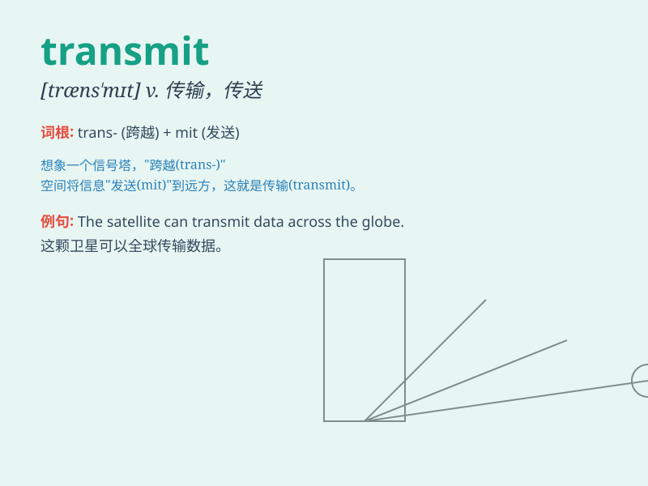

## transmit

**英音:** _[trænz\'mɪt; trɑːnz-; -ns-]_ **美音:**
_[trænzˈmɪt]_

**译义:** *vt.传输,转送,传达,传导,发射,遗传,传播vi.发射信号,发报*

### 短语

+ **transmit information:** _传输信息_

+ **transmit signals:** _传送信号_

+ **transmit diseases:** _传播疾病_

+ **transmit knowledge:** _传授知识_

+ **transmit power:** _传输电力_

### 例句

#### 例句1

> **The radio station transmits news every hour.**

**中文翻译:** 广播电台每小时传送一次新闻。

**单词释义:** 播送；传输

#### 例句2

> **Disease can be transmitted from one person to another.**

**中文翻译:** 疾病可以从一个人传染给另一个人。

**单词释义:** 传染；传递

#### 例句3

> **The satellite transmits signals to Earth.**

**中文翻译:** 卫星向地球传输信号。

**单词释义:** 传送；发射

### 背诵小故事

> A brave messenger was given the task to transmit important secrets.
He crossed mountains and rivers, never stopping, until he safely
delivered the information to the destination. Remember, \'transmit\'
means to send or pass on something.

**一位勇敢的信使被赋予了传递重要机密的任务。他翻山越岭，从未停歇，直到将信息安全送达目的地。记住，'transmit'意思是传送或传递某物。**

### 图义

