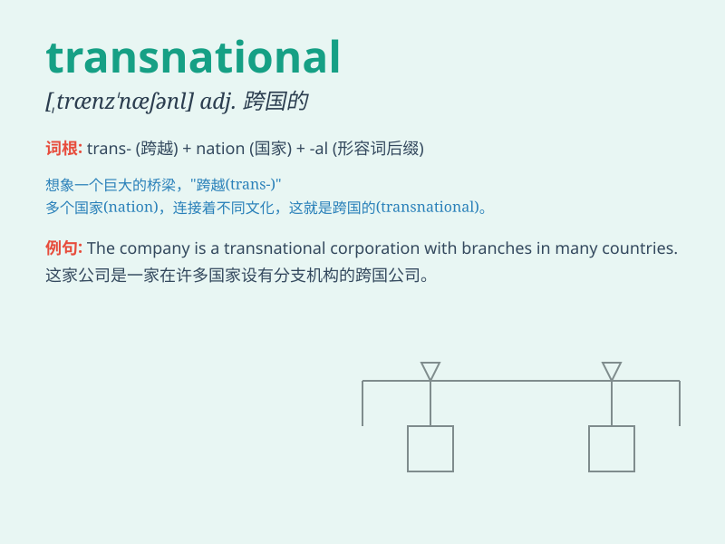

## transnational

**英音:** _[transnaʃənl]_ **美音:** _[transnæʃənl]_

**译义:** *adj.跨国的，跨越国家的；国际间的*

### 短语

+ **transnational corporation:** _跨国公司_

+ **transnational crime:** _跨国犯罪_

+ **transnational business:** _跨国业务_

+ **transnational project:** _跨国项目_

+ **transnational movement:** _跨国运动_

### 例句

#### 例句1

> **The company has become a transnational enterprise with branches
all over the world.**

**中文翻译:** 这家公司已成为一家跨国企业，在世界各地都有分支机构。

**单词释义:** 跨国的

#### 例句2

> **Transnational marriages are becoming more common in today\'s
globalized world.**

**中文翻译:** 在当今全球化的世界中，跨国婚姻变得越来越常见。

**单词释义:** 跨国的

#### 例句3

> **The transnational criminal organization was finally brought to
justice.**

**中文翻译:** 这个跨国犯罪组织最终被绳之以法。

**单词释义:** 跨国的

### 背诵小故事

>
想象一家公司，它的业务跨越了多个国家，员工来自世界各地。这种跨越国界的经营就是'transnational'。就像跨国的航班，连接不同国家，这就是'transnational'的含义。

**想象一家跨越多个国家经营的公司来辅助理解'跨国的；超越国界的'这个单词**

### 图义

