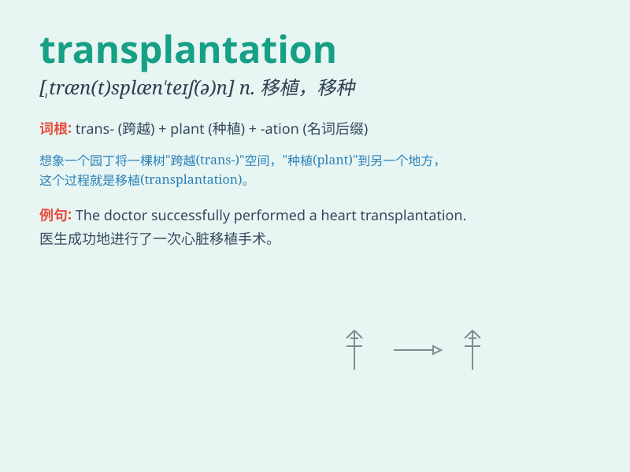

## transplantation

**英音:** _[ˌtrænsplɑːnˈteɪʃən]_ **美音:**
_[ˌtrænzplænˈteɪʃən]_

**译义:** *n.迁移,移植,移民*

### 短语

+ **organ transplantation:** _器官移植_

+ **heart transplantation:** _心脏移植_

+ **kidney transplantation:** _肾脏移植_

+ **bone marrow transplantation:** _骨髓移植_

+ **liver transplantation:** _肝脏移植_

### 例句

#### 例句1

> **The transplantation of organs has saved many lives.**

**中文翻译:** 器官移植挽救了许多人的生命。

**单词释义:** 器官移植

#### 例句2

> **The transplantation of plants requires specific techniques.**

**中文翻译:** 植物的移植需要特定的技术。

**单词释义:** 植物移栽

#### 例句3

> **Hair transplantation is becoming more popular these days.**

**中文翻译:** 如今，毛发移植变得越来越流行。

**单词释义:** 头发移植

### 背诵小故事

> A patient was in critical condition and needed a transplantation. The
doctor worked hard to find a suitable organ and finally performed the
successful transplantation, saving the patient\'s life.

**一位病人病情危急，需要进行移植手术。医生努力寻找合适的器官，最终成功完成了移植，挽救了病人的生命。**

### 图义

