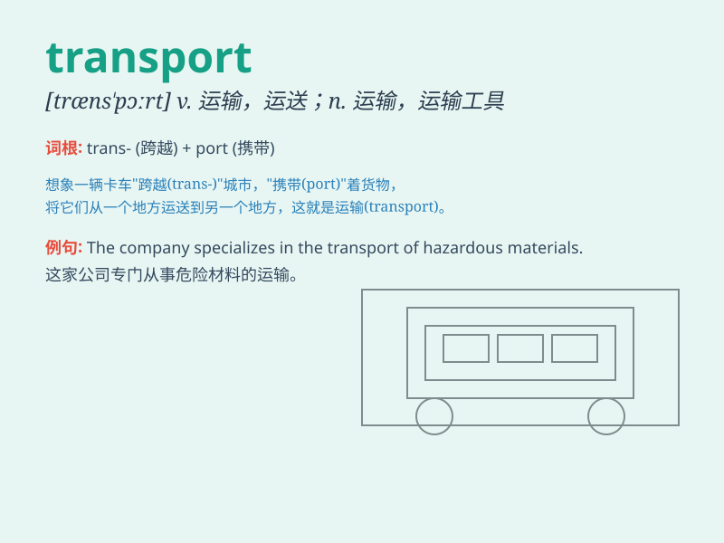

## transport

**英音:** _[træn\'spɔːt; trɑːn-]_ **美音:**
_[\'trænspɔrt]_

**译义:**
*n.传送器,运输,运输机,激动,流放犯,狂喜vt.传送,运输,流放,放逐*

### 短语

+ **public transport:** _公共交通_

+ **transport system:** _运输系统_

+ **means of transport:** _运输工具_

+ **transport goods:** _运输货物_

+ **transport costs:** _运输成本_

### 例句

#### 例句1

> **The goods were transported by train.**

**中文翻译:** 货物是通过火车运输的。

**单词释义:** 运输；运送

#### 例句2

> **Public transport is very convenient in this city.**

**中文翻译:** 这个城市的公共交通非常方便。

**单词释义:** 交通；运输工具

#### 例句3

> **The patient was transported to the hospital in an ambulance.**

**中文翻译:** 病人被救护车送往医院。

**单词释义:** 运输；移送

### 背诵小故事

> One day, Tom was in a hurry to go to work. But his car broke down.
Luckily, he found a transport bus and got on it. Finally, he reached the
office on time.

**一天，汤姆着急去上班。但他的车坏了。幸运的是，他找到了一辆运输巴士并上了车。最后，他按时到了办公室。**

### 图义

