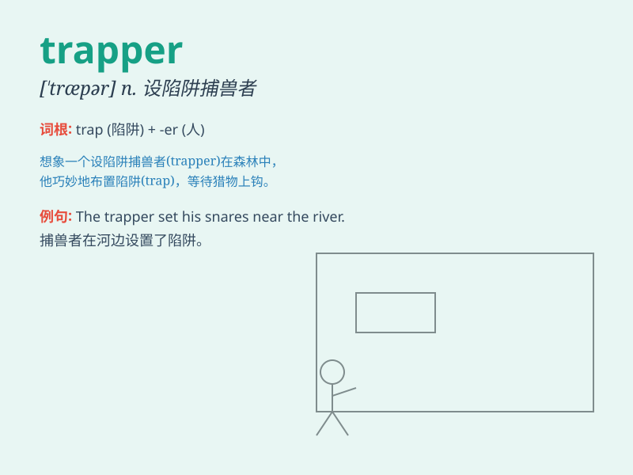

## trapper

**英音:** _[\'træpə]_ **美音:** _[\'træpɚ]_

**译义:** *n.设阱捕兽者,[矿]矿井风门开关管理员*

### 短语

+ **fur trapper:** _毛皮猎人_

+ **beaver trapper:** _海狸猎人_

+ **mountain trapper:** _山区捕猎者_

+ **skilled trapper:** _熟练的捕猎者_

+ **professional trapper:** _专业的捕猎者_

### 例句

#### 例句1

> **The trapper caught several foxes in his traps.**

**中文翻译:** 设陷阱的人在他的陷阱里捕获了几只狐狸。

**单词释义:** 捕兽者

#### 例句2

> **The trapper sells the furs to make a living.**

**中文翻译:** 捕兽者靠卖毛皮谋生。

**单词释义:** 捕兽人

#### 例句3

> **The experienced trapper knows all the tricks of the trade.**

**中文翻译:** 经验丰富的捕猎者知道所有的交易技巧。

**单词释义:** 捕兽者

### 背诵小故事

> A trapper was lost in the forest. He had traps to catch animals but
couldn\'t find his way out. Luckily, he remembered his skills and
followed the marks he left before, finally reaching home safely.

**一位捕兽者在森林里迷路了。他带着捕兽陷阱，但找不到出去的路。幸运的是，他想起了自己的技能，顺着之前留下的记号，最终安全到家。**

### 图义

