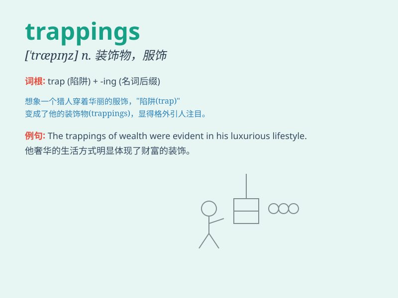

## trappings

**英音:** _[\'træpɪŋz]_ **美音:** _[\'træpɪŋz]_

**译义:** *n.服饰,马饰*

### 短语

+ **the trappings of power:** _权力的象征_

+ **the trappings of wealth:** _财富的外在标志_

+ **the trappings of office:** _官职的排场_

+ **the trappings of success:** _成功的标志_

+ **the trappings of ceremony:** _仪式的装饰_

### 例句

#### 例句1

> **The new job came with all the trappings of success, such as a big
office and a high salary.**

**中文翻译:** 新工作带来了所有成功的标志，比如大办公室和高薪水。

**单词释义:** 象征，标志（尤指与成功、地位有关的外在事物）

#### 例句2

> **He was attracted by the trappings of wealth and power.**

**中文翻译:** 他被财富和权力的象征所吸引。

**单词释义:** （财富、权力的）外在标志，虚饰

#### 例句3

> **The trappings of monarchy are often very elaborate.**

**中文翻译:** 君主制的装饰往往非常精致。

**单词释义:** （与某一职位或地位有关的）服饰，装饰

### 背诵小故事

> A king was always proud of his trappings, like the shiny crown and
the elegant robe. But one day, he realized that true power lies not in
these trappings but in kindness and wisdom.

**一位国王总是为他的服饰和装饰品感到骄傲，比如闪亮的王冠和优雅的长袍。但有一天，他意识到真正的权力不在于这些外在的装饰，而在于善良和智慧。**

### 图义

