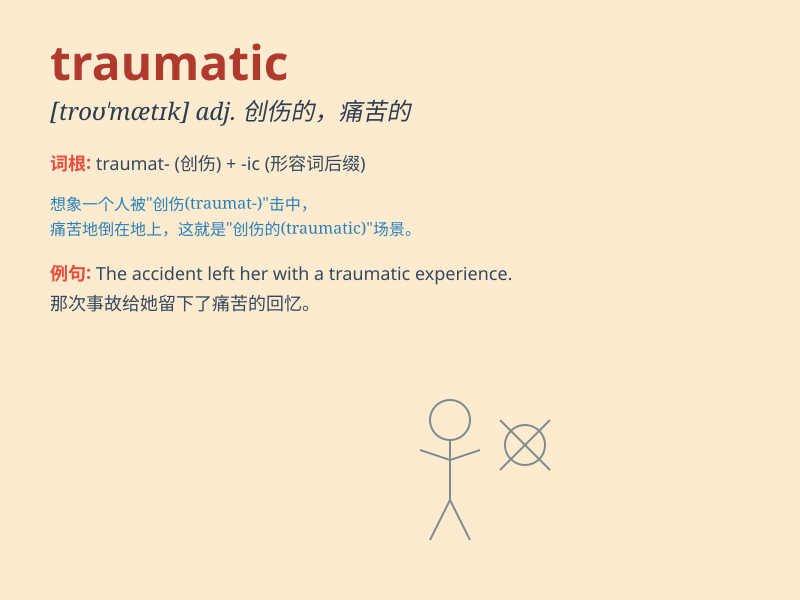

## traumatic

**英音:** _[trɔː\'mætɪk; traʊ-]_ **美音:**
_[traʊ\'mætɪk]_

**译义:** *adj.外伤的,创伤的*

### 短语

+ **traumatic experience:** _创伤性经历_

+ **traumatic event:** _创伤性事件_

+ **traumatic brain injury:** _创伤性脑损伤_

+ **traumatic stress:** _创伤性压力_

+ **traumatic memory:** _创伤性记忆_

### 例句

#### 例句1

> **The accident was a traumatic experience for her.**

**中文翻译:** 这次事故对她来说是一次痛苦的经历。

**单词释义:** 痛苦的；极不愉快的

#### 例句2

> **He suffered a traumatic brain injury in the war.**

**中文翻译:** 他在战争中遭受了脑外伤。

**单词释义:** 创伤性的

#### 例句3

> **The divorce was a traumatic event in his life.**

**中文翻译:** 离婚是他一生中的一次创伤事件。

**单词释义:** 造成精神创伤的

### 背诵小故事

> A brave soldier was in a war. The experience was traumatic. He saw
friends getting hurt and heard loud bombs. But he was strong and finally
overcame the hard memory.

**一位勇敢的士兵参加了一场战争。这段经历是创伤性的。他看到朋友受伤，听到巨大的爆炸声。但他很坚强，最终克服了这段艰难的记忆。**

### 图义

