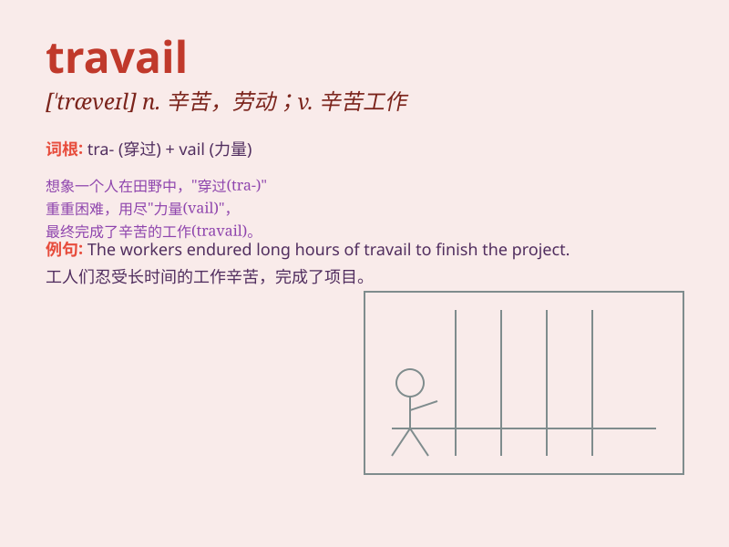

## travail

**英音:** _[\'træveɪl]_ **美音:** _[trəˈveɪl]_

**译义:** *n.辛苦*

### 短语

+ **travail of mind:** _精神上的痛苦_

+ **travail and pain:** _辛劳和痛苦_

+ **in travail:** _在分娩中；在艰苦努力中_

+ **travail of soul:** _心灵的煎熬_

+ **endless travail:** _无尽的劳苦_

### 例句

#### 例句1

> **She endured great travail during her long illness.**

**中文翻译:** 她在长期患病期间忍受了巨大的痛苦。

**单词释义:** 痛苦；艰苦劳动

#### 例句2

> **The project involved much travail but was finally completed
successfully.**

**中文翻译:** 该工程历经千辛万苦，但最终还是顺利完成。

**单词释义:** 艰辛；劳苦

#### 例句3

> **His life was filled with travail and struggle.**

**中文翻译:** 他的一生充满了艰辛和奋斗。

**单词释义:** 艰难；奋斗

### 背诵小故事

> A brave adventurer named Tom faced many travails during his journey.
He got lost, had no food, but still persisted. Finally, he overcame all
the travails and reached his destination. Travail means hardship or
toil.

**一位名叫汤姆的勇敢冒险家在旅途中面临许多艰难困苦。他迷路了，没有食物，但仍然坚持。最后，他克服了所有的艰难困苦，到达了目的地。travail
意思是艰难困苦或辛苦劳动。**

### 图义

