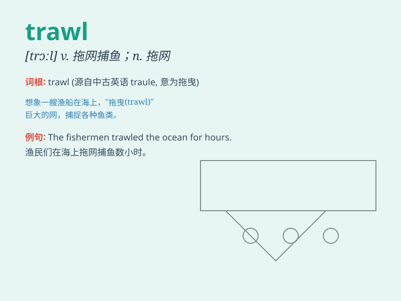

## trawl

**英音:** _[trɔːl]_ **美音:** _[trɔl]_

**译义:** *n.[渔] 拖网v.用拖网捕鱼*

### 短语

+ **trawl net:** _拖网_

+ **trawl fishing:** _拖网捕鱼_

+ **trawl through:** _仔细搜寻_

+ **deep-sea trawl:** _深海拖网_

+ **bottom trawl:** _底拖网_

### 例句

#### 例句1

> **The fishermen trawl the sea for fish every day.**

**中文翻译:** 渔民每天都到海里拖网捕鱼。

**单词释义:** 用拖网捕鱼

#### 例句2

> **She trawled through the internet looking for information.**

**中文翻译:** 她在互联网上搜寻信息。

**单词释义:** 搜索；搜罗

#### 例句3

> **The police trawl the area for clues.**

**中文翻译:** 警方在该地区搜寻线索。

**单词释义:** 仔细搜寻

### 背诵小故事

> A fisherman went trawling in the deep sea. He threw a large net and
slowly pulled it, hoping to catch many fish. Trawling is like this
action of using a net to search and catch things.

**一位渔夫去深海拖网捕鱼。他抛出一张大网然后慢慢拉回，期望能捕到很多鱼。trawl
就像这种用网搜寻和捕捞东西的动作。**

### 图义

