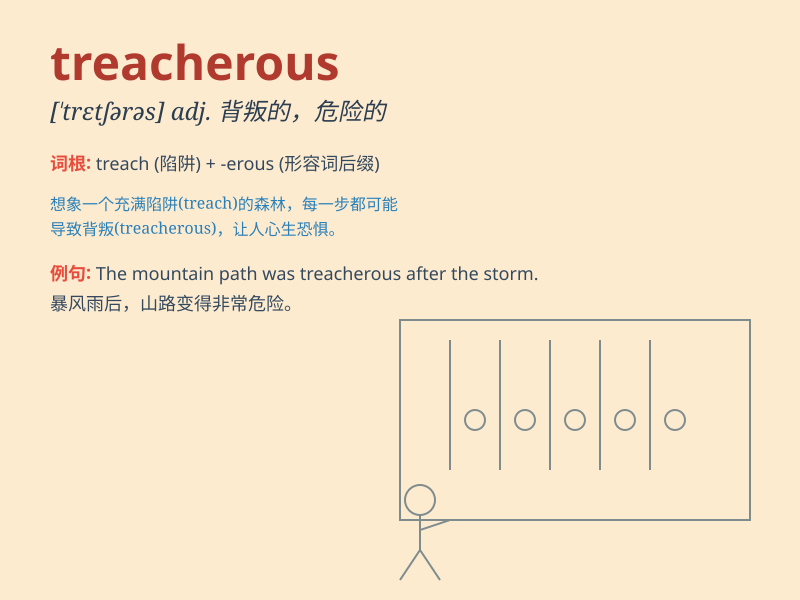

## treacherous

**英音:** _[\'tretʃ(ə)rəs]_ **美音:** _[\'trɛtʃərəs]_

**译义:** *adj.背叛的,背信弃义的,奸诈的,叛逆的*

### 短语

+ **treacherous terrain:** _危险的地形_

+ **treacherous road:** _危险的道路_

+ **treacherous weather:** _恶劣的天气_

+ **treacherous waters:** _危险的水域_

+ **treacherous act:** _背叛行为_

### 例句

#### 例句1

> **The road was treacherous after the heavy snowfall.**

**中文翻译:** 大雪过后，这条路很危险。

**单词释义:** 危险的；变化莫测的

#### 例句2

> **He was accused of being treacherous to his friends.**

**中文翻译:** 他被指责对朋友不忠。

**单词释义:** 不忠的；背信弃义的

#### 例句3

> **The treacherous current made swimming in the river very
dangerous.**

**中文翻译:** 湍急的水流使在河里游泳非常危险。

**单词释义:** 凶险的；暗藏危险的

### 背诵小故事

> A traveler was on a treacherous mountain path. One wrong step and he
would fall. The path was full of hidden holes and loose stones. It was
so treacherous that he had to be extremely careful.

**一位旅行者走在一条危险的山路上。走错一步他就会跌落。这条路布满了隐藏的坑洞和松动的石头。它是如此的危险，以至于他必须极其小心。**

### 图义

