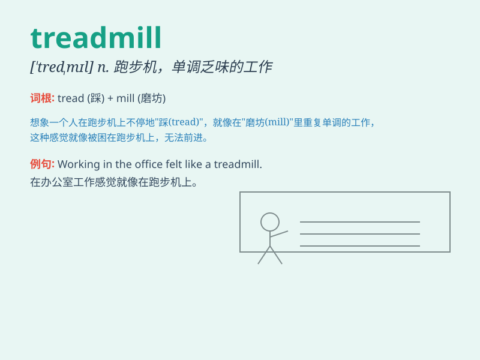

## treadmill

**英音:** _[\'tredmɪl]_ **美音:** _[\'trɛdmɪl]_

**译义:** *n.踏车,单调的工作*

### 短语

+ **on the treadmill:** _在跑步机上_

+ **treadmill exercise:** _跑步机锻炼_

+ **commercial treadmill:** _商用跑步机_

+ **treadmill running:** _在跑步机上跑步_

+ **portable treadmill:** _便携式跑步机_

### 例句

#### 例句1

> **I got bored with the treadmill at the gym.**

**中文翻译:** 我对健身房里的踏步机感到厌倦了。

**单词释义:** 踏步机；单调的工作

#### 例句2

> **The daily routine of work felt like a treadmill.**

**中文翻译:** 日常的工作流程感觉就像单调乏味的重复劳动。

**单词释义:** 单调乏味的工作

#### 例句3

> **He spent hours on the treadmill to stay fit.**

**中文翻译:** 他在踏步机上花了好几个小时来保持健康。

**单词释义:** 踏步机

### 背诵小故事

> A man was very tired after running on the treadmill. He thought it
was like a never-ending road. But he kept going, knowing it would make
him stronger. Treadmill means a machine for running or walking while
staying in one place.

**一个男人在跑步机上跑步后非常累。他觉得这就像一条没有尽头的路。但他坚持跑下去，知道这会让他更强壮。treadmill
意思是原地跑步或行走的机器。**

### 图义

