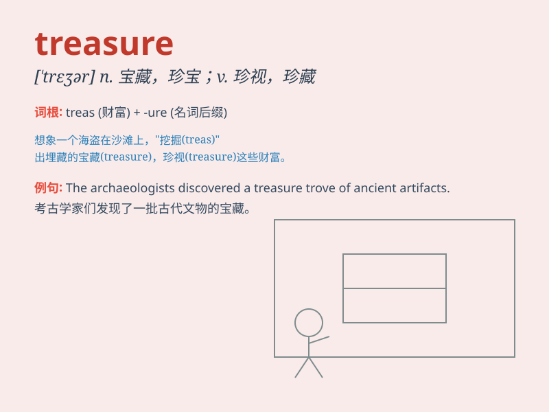

## treasure

**英音:** _[\'treʒə]_ **美音:** _[\'trɛʒɚ]_

**译义:** *n.财宝,财富,珍品,财产vt.珍爱,珍惜,储藏,珍藏*

### 短语

+ **treasure hunt:** _寻宝游戏；寻找珍宝_

+ **treasure chest:** _财宝箱；宝库_

+ **national treasure:** _国宝_

+ **treasure trove:** _无主财宝；珍藏物_

+ **buried treasure:** _埋藏的财宝_

### 例句

#### 例句1

> **She treasures her memories of childhood.**

**中文翻译:** 她珍视她童年的记忆。

**单词释义:** 珍视

#### 例句2

> **The pirates were hunting for buried treasure.**

**中文翻译:** 海盗们在寻找埋藏的财宝。

**单词释义:** 财宝

#### 例句3

> **It\'s a treasure trove of information.**

**中文翻译:** 这是一个信息宝库。

**单词释义:** 宝库

### 背诵小故事

> A brave adventurer was lost in a cave. But he found a hidden chest
filled with jewels and gold. He knew these were treasures that would
change his life. He carefully carried them home, feeling extremely
lucky.

**一位勇敢的冒险家在一个洞穴中迷路了。但他发现了一个隐藏的宝箱，里面装满了珠宝和黄金。他知道这些是能改变他一生的财宝。他小心翼翼地把它们带回家，感到无比幸运。**

### 图义

