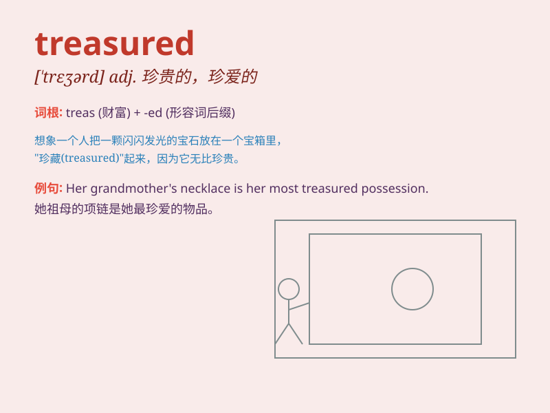

## treasured

**英音:** _[ˈtreʒəd]_ **美音:** _[ˈtreʒərd]_

**译义:** *adj. 珍贵的；宝贵的；珍视的；受珍爱的；被重视的*

### 短语

+ **treasured possession:** _珍贵的财产_

+ **treasured memory:** _珍贵的回忆_

+ **treasured moment:** _珍贵的时刻_

+ **treasured friend:** _珍贵的朋友_

+ **treasured experience:** _珍贵的经历_

### 例句

#### 例句1

> **The old watch was a treasured possession passed down from his
grandfather.**

**中文翻译:** 这块旧手表是从他祖父那里传下来的珍贵财产。

**单词释义:** 珍贵的

#### 例句2

> **She treasured the memories of their time together.**

**中文翻译:** 她珍视他们在一起的时光的记忆。

**单词释义:** 珍视

#### 例句3

> **The book is one of her most treasured belongings.**

**中文翻译:** 这本书是她最珍贵的财物之一。

**单词释义:** 珍贵的

### 背诵小故事

> Once upon a time, a little girl found a hidden box. Inside was a
treasured necklace that had been passed down for generations. It was so
precious and everyone took good care of it.

**从前，有个小女孩发现了一个隐藏的盒子。里面是一条世代相传的珍贵项链。它是如此的珍贵，每个人都悉心呵护它。**

### 图义

