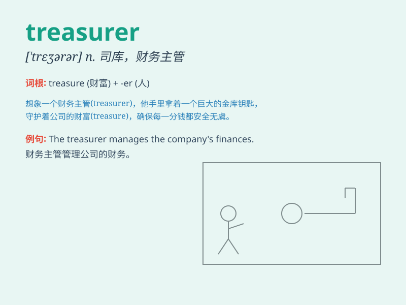

## treasurer

**英音:** _[\'treʒ(ə)rə]_ **美音:** _[\'trɛʒərɚ]_

**译义:** *n.司库,财务员,出纳员*

### 短语

+ **company treasurer:** _公司财务主管_

+ **treasurer report:** _财务主管报告_

+ **assistant treasurer:** _助理财务主管_

+ **treasurer position:** _财务主管职位_

+ **experienced treasurer:** _经验丰富的财务主管_

### 例句

#### 例句1

> **The treasurer is responsible for managing the club\'s
finances.**

**中文翻译:** 财务主管负责管理俱乐部的财务。

**单词释义:** 财务主管

#### 例句2

> **She was elected treasurer of the student council.**

**中文翻译:** 她被选为学生会的财务主管。

**单词释义:** 财务主管

#### 例句3

> **The treasurer presented the financial report at the meeting.**

**中文翻译:** 财务主管在会议上提交了财务报告。

**单词释义:** 财务主管

### 背诵小故事

> Once upon a time, in a kingdom, there was a person named Tom. He was
responsible for managing all the treasures and money. Tom was known as
the treasurer. His job was to keep everything safe and organized.

**从前，在一个王国里，有一个叫汤姆的人。他负责管理所有的财宝和金钱。汤姆被称为财务主管。他的工作是保证一切安全且井井有条。**

### 图义

