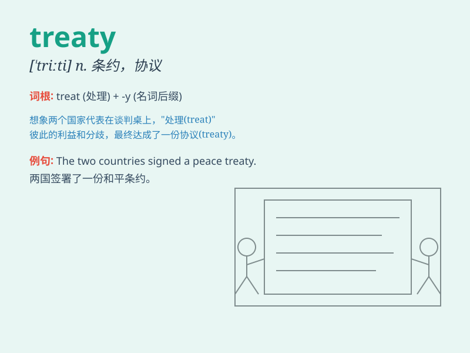

## treaty

**英音:** _[\'triːtɪ]_ **美音:** _[\'triti]_

**译义:** *n.条约,谈判*

### 短语

+ **peace treaty:** _和平条约_

+ **trade treaty:** _贸易条约_

+ **armistice treaty:** _停战协定_

+ **defense treaty:** _防御条约_

+ **boundary treaty:** _边界条约_

### 例句

#### 例句1

> **The two countries signed a peace treaty.**

**中文翻译:** 这两个国家签署了一份和平条约。

**单词释义:** 条约

#### 例句2

> **The treaty was violated by one of the parties.**

**中文翻译:** 该条约被其中一方违反了。

**单词释义:** 条约

#### 例句3

> **They are negotiating a new trade treaty.**

**中文翻译:** 他们正在协商一项新的贸易条约。

**单词释义:** 条约

### 背诵小故事

> A king and a queen were in a big meeting. They wanted to end the war
and have peace. So, they signed a treaty. The treaty said they would be
friends and not fight anymore.

**一位国王和一位王后正在举行一场大型会议。他们想要结束战争并实现和平。于是，他们签署了一份条约。这份条约表明他们将成为朋友，不再打仗。**

### 图义

