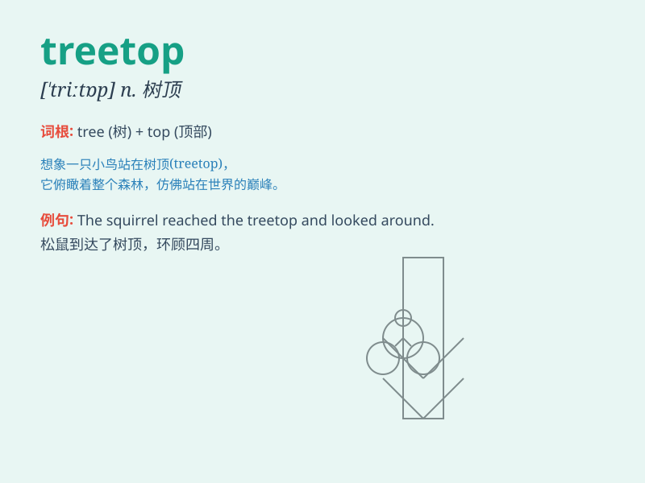

## treetop

**英音:** _[\'triːtɒp]_ **美音:** _[\'tri\'tɑp]_

**译义:** *n.树稍*

### 短语

+ **reach the treetop:** _到达树梢_

+ **climb to the treetop:** _爬到树梢_

+ **perch on the treetop:** _栖息在树梢_

+ **view from the treetop:** _从树梢看_

+ **stand at the treetop:** _站在树梢_

### 例句

#### 例句1

> **The bird is sitting on the treetop.**

**中文翻译:** 这只鸟正坐在树梢上。

**单词释义:** 树梢

#### 例句2

> **From the treetop, you can have a panoramic view of the
forest.**

**中文翻译:** 从树梢上，你可以看到森林的全景。

**单词释义:** 树梢

#### 例句3

> **The wind gently blew through the treetops.**

**中文翻译:** 风轻轻地吹过树梢。

**单词释义:** 树梢

### 背诵小故事

> One day, a little monkey climbed up to the treetop to look for food.
It saw beautiful views and felt very happy. But it had to be careful not
to fall. The treetop was the highest part of the tree.

**有一天，一只小猴子爬到树顶寻找食物。它看到了美丽的景色，感到非常开心。但它必须小心不要掉下来。树顶是树的最高部分。**

### 图义

