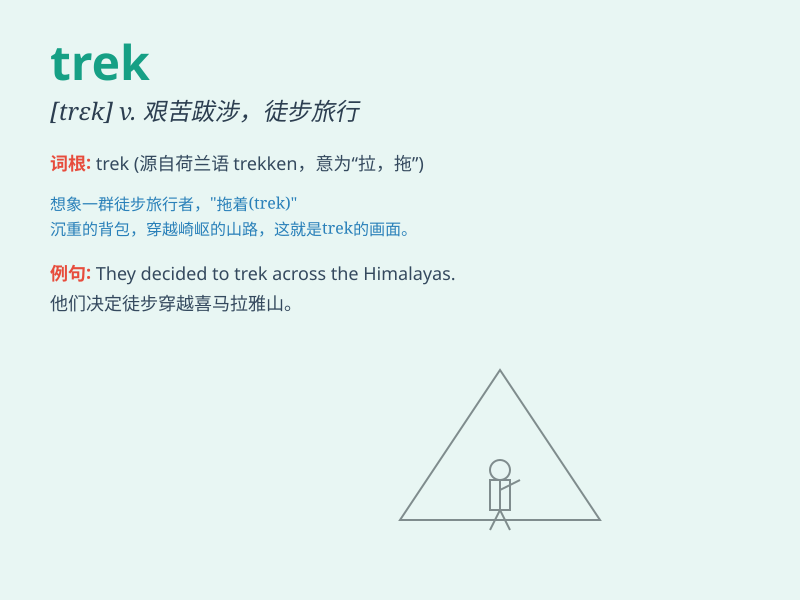

## trek

**英音:** _[trek]_ **美音:** _[trɛk]_

**译义:**
*vi.牛拉车,艰苦跋涉vt.(牛)拉(货车),搬,运n.牛拉车旅行,艰苦跋涉*

### 短语

+ **trek through:** _穿越，长途跋涉穿过_

+ **mountain trek:** _山地徒步旅行_

+ **trek along:** _沿着\...\...长途跋涉_

+ **desert trek:** _沙漠跋涉_

+ **trek expedition:** _长途跋涉探险_

### 例句

#### 例句1

> **They went on a long trek through the mountains.**

**中文翻译:** 他们进行了一次穿越山脉的长途跋涉。

**单词释义:** 长途跋涉；艰苦的旅行

#### 例句2

> **It\'s a three-day trek to reach the base camp.**

**中文翻译:** 到达大本营需要三天的艰苦行程。

**单词释义:** （尤指徒步）长途旅行

#### 例句3

> **The trek across the desert was extremely challenging.**

**中文翻译:** 穿越沙漠的长途跋涉极具挑战性。

**单词释义:** 艰难的旅行；跋涉

### 背诵小故事

> A group of friends decided to go on a trek. They walked through
mountains and forests, facing many difficulties but never giving up.
Finally, they reached a beautiful lake and enjoyed the amazing view. The
trek was tough but rewarding.

**一群朋友决定去长途跋涉。他们穿过山脉和森林，面临许多困难但从不放弃。最后，他们到达了一个美丽的湖，欣赏到了迷人的景色。这次跋涉很艰难但很值得。**

### 图义

