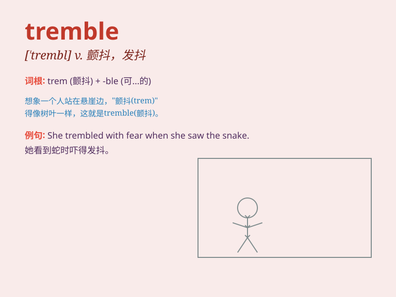

## tremble

**英音:** _[\'tremb(ə)l]_ **美音:** _[\'trɛmbl]_

**译义:**
*n.战栗,颤抖vi.战栗,发抖,震动,(树叶等)摇晃.摇动,焦虑vt.挥动,用颤抖的声音说出*

### 短语

+ **tremble with fear:** _因恐惧而颤抖_

+ **tremble at the thought:** _一想到就发抖_

+ **tremble in anger:** _气得发抖_

+ **tremble all over:** _浑身颤抖_

+ **tremble uncontrollably:** _无法控制地颤抖_

### 例句

#### 例句1

> **She trembled with fear when she saw the snake.**

**中文翻译:** 当她看到那条蛇时，她害怕得发抖。

**单词释义:** 发抖；颤抖

#### 例句2

> **The leaves trembled in the breeze.**

**中文翻译:** 树叶在微风中颤抖。

**单词释义:** 颤抖；抖动

#### 例句3

> **His voice trembled as he told the story.**

**中文翻译:** 他讲故事时声音颤抖。

**单词释义:** （声音）颤抖

### 背诵小故事

> A little mouse was walking in a dark cave. Suddenly, it heard a loud
roar. The mouse was so scared that it started to tremble. Its tiny body
shook uncontrollably as it feared for its life.

**一只小老鼠正在黑暗的洞穴里行走。突然，它听到一声巨响。老鼠非常害怕，开始颤抖。它小小的身体不受控制地抖动着，因为它担心自己的生命。**

### 图义

