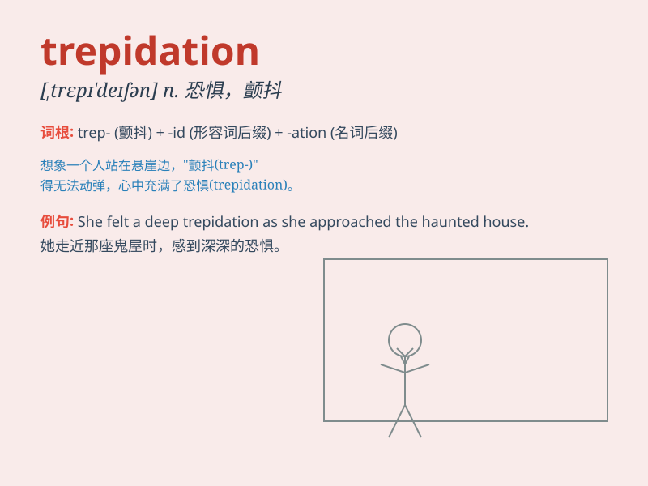

## trepidation

**英音:** _[,trepɪ\'deɪʃ(ə)n]_ **美音:**
_[ˌtrepəˈdeɪʃən]_

**译义:** *n.颤抖*

### 短语

+ **with trepidation:** _怀着恐惧；战战兢兢地_

+ **feel trepidation:** _感到惊恐；感到惶恐_

+ **trepidation and fear:** _惊恐和害怕_

+ **in trepidation:** _处于惊恐之中_

+ **overcome trepidation:** _克服惊恐_

### 例句

#### 例句1

> **She approached the exam with trepidation.**

**中文翻译:** 她怀着恐惧的心情参加考试。

**单词释义:** 恐惧；惶恐

#### 例句2

> **He felt trepidation at the thought of giving a speech in
public.**

**中文翻译:** 一想到要在公众面前演讲，他就感到惶恐。

**单词释义:** 惶恐；不安

#### 例句3

> **Despite her trepidation, she decided to take on the challenging
task.**

**中文翻译:** 尽管心怀恐惧，她还是决定承担这项具有挑战性的任务。

**单词释义:** 恐惧；担忧

### 背诵小故事

> A brave adventurer was about to enter a dark cave. His heart filled
with trepidation as he imagined unknown dangers inside. But he took a
deep breath and moved forward. Trepidation means a feeling of fear or
anxiety.

**一位勇敢的探险家即将进入一个黑暗的洞穴。他的心中充满了
trepidation，因为他想象着里面未知的危险。但他深吸一口气，向前走去。trepidation
意思是恐惧或焦虑的感觉。**

### 图义

