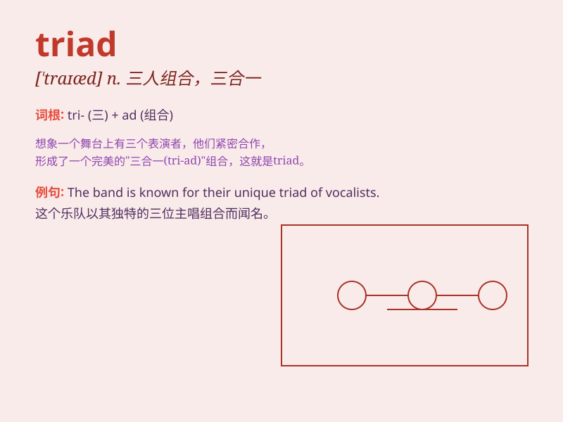

## triad

**英音:** _[\'traɪæd]_ **美音:** _[traɪæd]_

**译义:** *n.三个一组,三幅一组,[音]三和音*

### 短语

+ **chromatic triad:** _和声调式中的三和弦_

+ **major triad:** _大三和弦_

+ **minor triad:** _小三和弦_

+ **triad society:** _三合会_

+ **tonic triad:** _主三和弦_

### 例句

#### 例句1

> **The criminal organization was structured as a triad.**

**中文翻译:** 这个犯罪组织的结构是一个三合会。

**单词释义:** 三合会；三人组合；三个一组

#### 例句2

> **The triad of love, compassion, and kindness is essential for a
harmonious society.**

**中文翻译:**
爱、同情和善良的三位一体对于一个和谐的社会是必不可少的。

**单词释义:** 三个一组；三合一

#### 例句3

> **The triad of colors in this painting creates a beautiful
harmony.**

**中文翻译:** 这幅画中的三种颜色组合创造了一种美丽的和谐。

**单词释义:** 三个一组；三合一

### 背诵小故事

>
想象一下，在一个神秘的森林里，有三个小伙伴组成了一个强大的团队，他们被称为\'triad\'。这三个人总是一起行动，互相帮助，完成了很多艰难的任务。

**想象在神秘森林中，三个小伙伴组成的被称为\'triad\'的强大团队总是一起行动并完成艰难任务。**

### 图义

