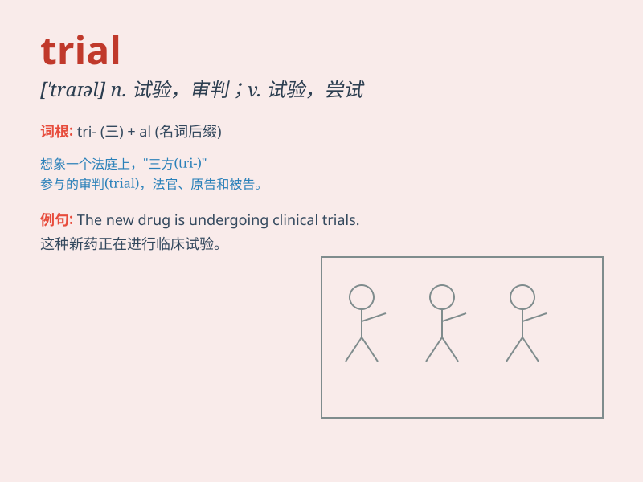

## trial

**英音:** _[\'traɪəl]_ **美音:** _[\'traɪəl]_

**译义:** *n.试验,考验,审讯,审判*

### 短语

+ **trial and error:** _反复试验；不断摸索_

+ **on trial:** _在受审；在试验中_

+ **clinical trial:** _临床试验_

+ **fair trial:** _公平审判_

+ **trial run:** _试运行；试车；试航_

### 例句

#### 例句1

> **The defendant was on trial for murder.**

**中文翻译:** 被告因谋杀罪受审。

**单词释义:** 审判；审讯

#### 例句2

> **We need to do a trial run before the actual performance.**

**中文翻译:** 在实际演出前我们需要进行一次试演。

**单词释义:** 试验；试用

#### 例句3

> **The new medicine is still in the trial stage.**

**中文翻译:** 这种新药仍处于试验阶段。

**单词释义:** 试验；实验

### 背诵小故事

> A brave athlete was facing a trial. He had to run a very long
distance. But he didn\'t give up and finally completed it. The trial
made him stronger.

**一位勇敢的运动员正在面临一场考验。他必须跑很长的距离。但他没有放弃，最终完成了。这场考验让他变得更强大。**

### 图义

