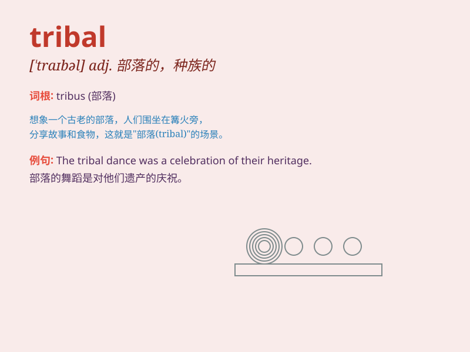

## tribal

**英音:** _[\'traɪb(ə)l]_ **美音:** _[\'traɪbl]_

**译义:** *adj.部落的,种族的*

### 短语

+ **tribal culture:** _部落文化_

+ **tribal dance:** _部落舞蹈_

+ **tribal warfare:** _部落战争_

+ **tribal leader:** _部落首领_

+ **tribal area:** _部落地区_

### 例句

#### 例句1

> **The tribal people have their own unique customs and
traditions.**

**中文翻译:** 部落人民有他们自己独特的习俗和传统。

**单词释义:** 部落的

#### 例句2

> **The tribal chief led the warriors into battle.**

**中文翻译:** 部落首领带领战士们投入战斗。

**单词释义:** 部落的

#### 例句3

> **She wore a tribal necklace as a symbol of her heritage.**

**中文翻译:** 她戴着一条部落项链作为她传统的象征。

**单词释义:** 部落的

### 背诵小故事

> In a remote jungle, there was a tribal community. They had unique
customs and wore special clothes. One day, a traveler visited and was
amazed by their tribal way of life. The word \'tribal\' refers to
something related to tribes.

**在一个偏远的丛林里，有一个部落社区。他们有着独特的习俗，穿着特别的衣服。有一天，一位旅行者来访，对他们的部落生活方式感到惊讶。'tribal'这个词指的是与部落有关的东西。**

### 图义

