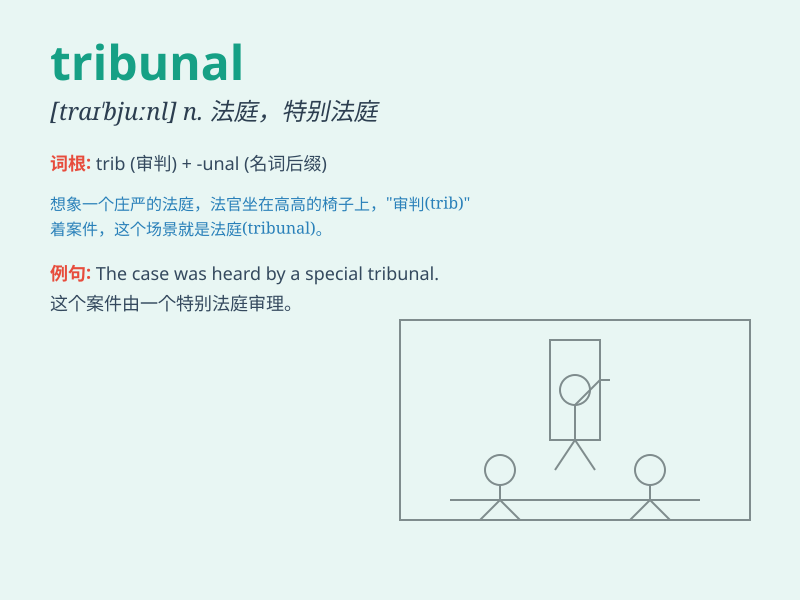

## tribunal

**英音:** _[traɪ\'bjuːn(ə)l; trɪ-]_ **美音:**
_[traɪ\'bjunl]_

**译义:** *n.法官席,审判员席,(特等)法庭*

### 短语

+ **industrial tribunal:** _劳资仲裁庭_

+ **military tribunal:** _军事法庭_

+ **arbitration tribunal:** _仲裁庭_

+ **people\'s tribunal:** _人民法庭_

+ **disciplinary tribunal:** _纪律法庭_

### 例句

#### 例句1

> **The case was heard in a criminal tribunal.**

**中文翻译:** 这个案件在刑事法庭审理。

**单词释义:** 法庭；裁判所

#### 例句2

> **He decided to appeal to the tribunal against the unfair
decision.**

**中文翻译:** 他决定向裁判所上诉，反对这不公平的决定。

**单词释义:** 裁判所；法庭

#### 例句3

> **The labor tribunal ruled in favor of the employee.**

**中文翻译:** 劳动法庭做出了有利于员工的裁决。

**单词释义:** 法庭；裁判所

### 背诵小故事

> A brave lawyer was fighting for justice in a tribunal. The tribunal
was like a big stage where truth and fairness were decided. He was
determined to prove his client\'s innocence and make the right judgment
prevail.

**一位勇敢的律师在法庭上为正义而战。法庭就像一个大舞台，在这里决定着真相和公平。他决心证明他的客户是清白的，并让正确的判决占上风。**

### 图义

