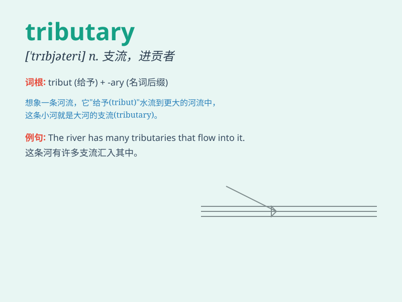

## tributary

**英音:** _[\'trɪbjʊt(ə)rɪ]_ **美音:**
_[\'trɪbjə\'tɛri]_

**译义:**
*adj.进贡的,附庸的,从属的,辅助的,支流的n.进贡国,附庸国,支流*

### 短语

+ **tributary river:** _支流河_

+ **tributary system:** _朝贡制度_

+ **tributary state:** _附属国_

+ **tributary branch:** _支流分支_

+ **tributary valley:** _支流山谷_

### 例句

#### 例句1

> **The river has several tributaries that flow into it.**

**中文翻译:** 这条河有几条支流流入其中。

**单词释义:** 支流

#### 例句2

> **This small stream is a tributary of the larger river.**

**中文翻译:** 这条小溪是那条大河的支流。

**单词释义:** 支流

#### 例句3

> **The country was once a tributary state of a powerful empire.**

**中文翻译:** 这个国家曾经是一个强大帝国的附属国。

**单词释义:** 附属国

### 背诵小故事

> A long time ago, in a kingdom, there was a small river. This river
always gave water to the big river as a tribute. So, people called it a
tributary. It was like a loyal helper.

**很久以前，在一个王国里，有一条小河。这条小河总是向大河送水作为贡物。所以，人们称它为支流。它就像一个忠诚的助手。**

### 图义

