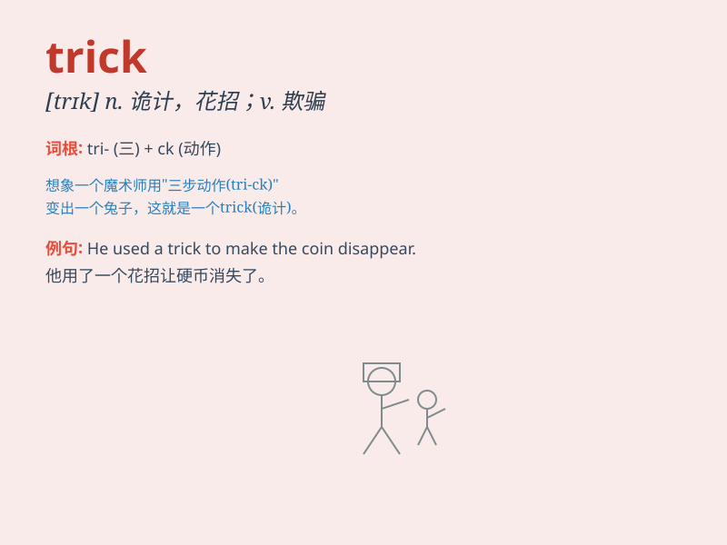

## trick

**英音:** _[trɪk]_ **美音:** _[trɪk]_

**译义:** *n.诡计,骗局,恶作剧,窍门,诀窍vt.欺骗,哄骗*

### 短语

+ **play a trick:** _搞恶作剧；捉弄_

+ **trick or treat:** _不给糖就捣蛋（万圣节时孩子们的活动）_

+ **clever trick:** _巧妙的诡计_

+ **magic trick:** _魔术；魔法把戏_

+ **trick question:** _陷阱问题；故意刁难的问题_

### 例句

#### 例句1

> **The magician performed a wonderful trick to amaze the
audience.**

**中文翻译:** 这位魔术师表演了一个精彩的戏法，让观众感到惊奇。

**单词释义:** 戏法；魔术

#### 例句2

> **It was a trick question and I got it wrong.**

**中文翻译:** 这是一个陷阱问题，我答错了。

**单词释义:** 诡计；骗局

#### 例句3

> **She played a trick on her brother and hid his shoes.**

**中文翻译:** 她捉弄了她的弟弟，把他的鞋子藏起来了。

**单词释义:** 捉弄；恶作剧

### 背诵小故事

> One Halloween night, a little boy wanted to play a trick on his
sister. He hid in the closet and jumped out suddenly, scaring her. But
his sister wasn\'t angry. She laughed and said, \'That was a funny
trick!\'

**在一个万圣节的夜晚，一个小男孩想捉弄他的姐姐。他藏在衣柜里然后突然跳出来，吓到了她。但他的姐姐没有生气。她笑着说：'这是个有趣的恶作剧！'**

### 图义

