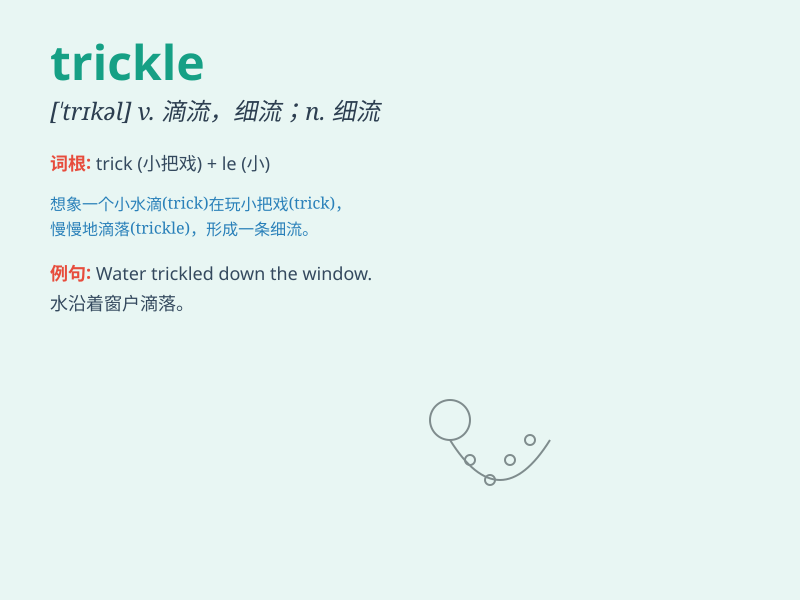

## trickle

**英音:** _[\'trɪk(ə)l]_ **美音:** _[\'trɪkl]_

**译义:** *v.滴流*

### 短语

+ **trickle down:** _（财富等）逐渐下传_

+ **trickle in:** _陆续进入；缓慢地流入_

+ **trickle out:** _慢慢流出；逐渐泄漏_

+ **a trickle of something:** _少量的某物；涓涓细流般的某物_

+ **trickle through:** _慢慢通过；逐渐渗透_

### 例句

#### 例句1

> **A trickle of water ran down the mountain.**

**中文翻译:** 一股细流从山上流下来。

**单词释义:** 细流

#### 例句2

> **People began to trickle into the hall.**

**中文翻译:** 人们开始慢慢进入大厅。

**单词释义:** 慢慢移动

#### 例句3

> **Information trickled out over the following weeks.**

**中文翻译:** 在接下来的几周里，消息逐渐透露出来。

**单词释义:** 逐渐流出

### 背诵小故事

> A little boy was playing with a hose. Water started to trickle out
slowly. He was so excited to see the tiny stream. Just like this,
imagine water flowing in a small and slow way - that\'s \'trickle\'.

**一个小男孩在玩水管。水开始慢慢地滴出来。他看到这细细的水流很兴奋。就像这样，想象水以缓慢细小的方式流动------这就是'trickle（滴，流淌）'。**

### 图义

