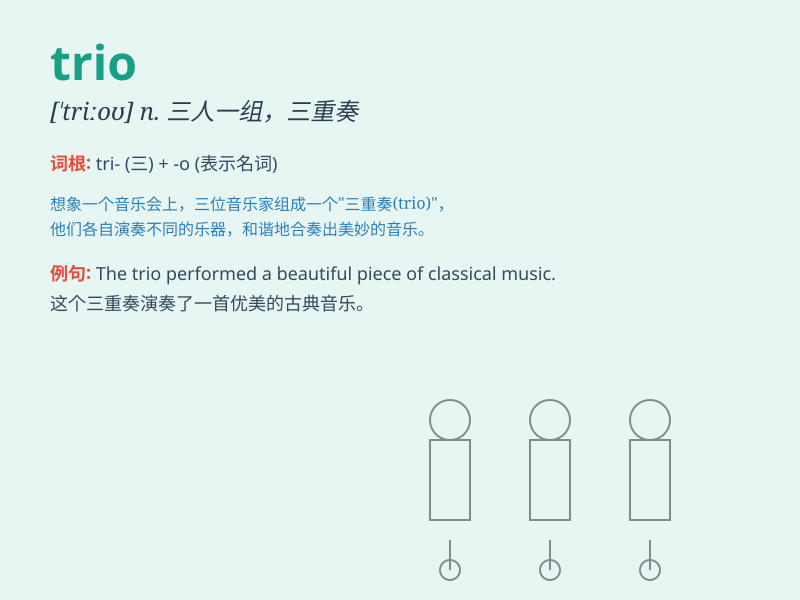

## trio

**英音:** _[\'triːəʊ]_ **美音:** _[\'trio]_

**译义:** *n.三重唱*

### 短语

+ **a jazz trio:** _一个爵士三重奏_

+ **trio performance:** _三重奏表演_

+ **vocal trio:** _声乐三重唱_

+ **instrumental trio:** _器乐三重奏_

+ **trio of dancers:** _三人舞蹈组合_

### 例句

#### 例句1

> **The trio of musicians gave a wonderful performance last
night.**

**中文翻译:** 这三位音乐家昨晚进行了一场精彩的演出。

**单词释义:** 三个一组；三人一组；三件一套

#### 例句2

> **The trio of friends decided to go on a trip together.**

**中文翻译:** 这三个朋友决定一起去旅行。

**单词释义:** 三个一组；三人一组；三件一套

#### 例句3

> **The painting shows a trio of flowers in a vase.**

**中文翻译:** 这幅画展示了花瓶里的三枝花。

**单词释义:** 三个一组；三人一组；三件一套

### 背诵小故事

> Three musicians formed a trio. They practiced hard every day. One
played the piano, one the violin, and one the cello. Their music was
beautiful. Remember, trio means a group of three.

**三位音乐家组成了一个三重奏。他们每天都努力练习。一个弹钢琴，一个拉小提琴，一个拉大提琴。他们的音乐很美妙。记住，trio
意思是三个一组。**

### 图义

