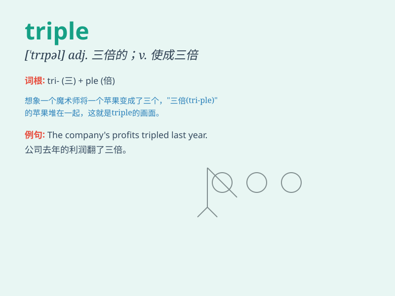

## triple

**英音:** _[\'trɪp(ə)l]_ **美音:** _[\'trɪpl]_

**译义:** *n.三倍数,三个一组adj.三倍的vt.三倍与vi.增至三倍*

### 短语

+ **triple jump:** _三级跳远_

+ **triple threat:** _三重威胁_

+ **triple alliance:** _三国同盟_

+ **triple digit:** _三位数_

+ **triple dose:** _三倍剂量_

### 例句

#### 例句1

> **The company\'s profits tripled last year.**

**中文翻译:** 这家公司去年的利润增长了两倍。

**单词释义:** （使）增至三倍

#### 例句2

> **The bedroom is triple the size of the living room.**

**中文翻译:** 卧室的面积是客厅的三倍。

**单词释义:** 是......的三倍

#### 例句3

> **She received a triple dose of medicine.**

**中文翻译:** 她接受了三倍剂量的药。

**单词释义:** 三倍的

### 背诵小故事

> Once upon a time, there was a magic race. The winner would get triple
rewards: three gold medals, three big cakes, and three beautiful toys.
So, \'triple\' means three times as much or as many.

**从前，有一场神奇的比赛。获胜者将获得三倍的奖励：三块金牌、三个大蛋糕和三件漂亮的玩具。所以，'triple'意思是三倍的。**

### 图义

