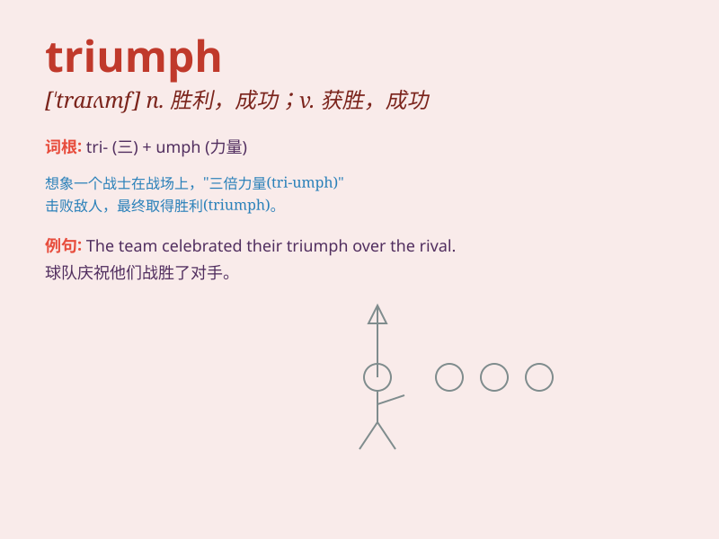

## triumph

**英音:** _[\'traɪʌmf]_ **美音:** _[ˈtraɪəmf]_

**译义:** *n.胜利,成功v.获得胜利*

### 短语

+ **triumph over:** _战胜；击败；克服_

+ **in triumph:** _胜利地；得意洋洋地_

+ **triumph of the will:**
_意志的胜利（常用于描述一种强调意志力和决心的成功）_

+ **a moment of triumph:** _胜利的时刻_

+ **triumph in sth.:** _因某事而成功；在某事上获胜_

### 例句

#### 例句1

> **The team\'s victory was a great triumph.**

**中文翻译:** 这个团队的胜利是一次巨大的成功。

**单词释义:** 成功；胜利

#### 例句2

> **She triumphed over her illness and returned to work.**

**中文翻译:** 她战胜了疾病，重返工作岗位。

**单词释义:** 战胜；克服

#### 例句3

> **The new policy was a triumph of common sense.**

**中文翻译:** 新政策是常识的胜利。

**单词释义:** 胜利；成功之举

### 背诵小故事

> A brave knight faced many challenges in the battle. Despite the odds,
he fought with all his might and finally achieved TRIUMPH. His victory
was celebrated by the people, making him a hero.

**一位勇敢的骑士在战斗中面临诸多挑战。尽管困难重重，他全力战斗，最终取得了胜利。他的胜利受到了人们的庆祝，使他成为了英雄。**

### 图义

