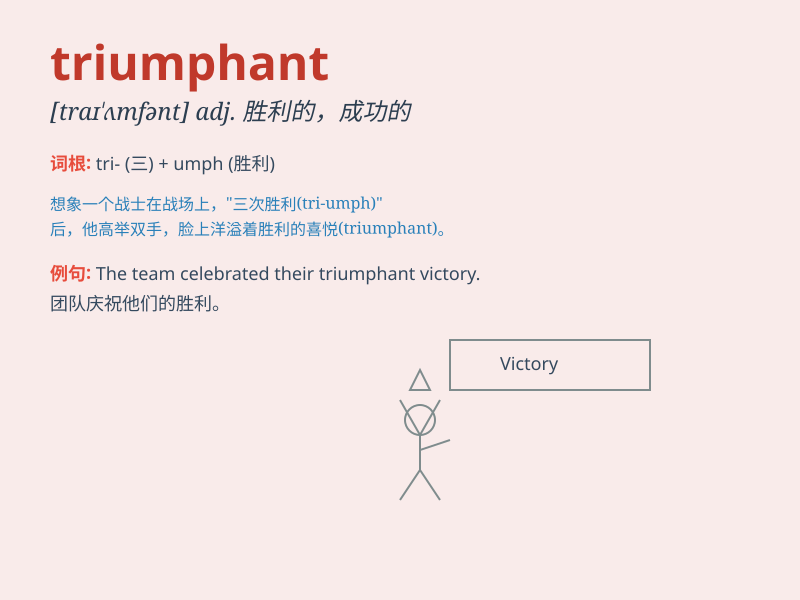

## triumphant

**英音:** _[traɪ\'ʌmf(ə)nt]_ **美音:** _[traɪ\'ʌmfənt]_

**译义:** *adj.胜利的,成功的,狂欢的,洋洋得意的*

### 短语

+ **triumphant return:** _胜利归来_

+ **triumphant smile:** _胜利的微笑_

+ **triumphant victory:** _辉煌的胜利_

+ **triumphant celebration:** _胜利的庆祝_

+ **triumphant march:** _胜利的行进_

### 例句

#### 例句1

> **The team returned home triumphant after winning the
championship.**

**中文翻译:** 这支队伍在赢得冠军后胜利归来。

**单词释义:** 胜利的；成功的；得意洋洋的

#### 例句2

> **She had a triumphant smile on her face when she received the
award.**

**中文翻译:** 当她收到奖项时，脸上带着胜利的微笑。

**单词释义:** 成功的；得意洋洋的

#### 例句3

> **The general led his troops in a triumphant battle.**

**中文翻译:** 将军率领他的部队打了一场胜仗。

**单词释义:** 胜利的

### 背诵小故事

> A brave knight was in a fierce battle. Despite many difficulties, he
fought bravely and finally won. Standing on the battlefield, he felt
triumphant. His victory made him proud and happy.

**一位勇敢的骑士参加了一场激烈的战斗。尽管困难重重，他英勇作战，最终获胜。站在战场上，他感到胜利的喜悦。他的胜利让他感到骄傲和快乐。**

### 图义

