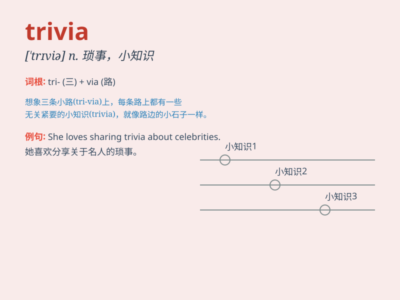

## trivia

**英音:** _[\'trɪvɪə]_ **美音:** _[\'trɪvɪə]_

**译义:** *n.琐事*

### 短语

+ **trivia question:** _琐碎问题；小问题_

+ **trivia game:** _琐事游戏_

+ **collect trivia:** _收集琐事_

+ **trivia knowledge:** _琐碎的知识_

+ **share trivia:** _分享琐事_

### 例句

#### 例句1

> **The game show was filled with trivia questions about history and
pop culture.**

**中文翻译:** 这个游戏节目充满了关于历史和流行文化的琐碎问题。

**单词释义:** 琐碎的事物；不重要的细节

#### 例句2

> **She spent hours discussing trivia with her friends.**

**中文翻译:** 她花了几个小时和她的朋友们讨论琐事。

**单词释义:** 琐事；细枝末节

#### 例句3

> **His mind was occupied with trivia instead of important
matters.**

**中文翻译:** 他的心思被琐事占据，而不是重要的事情。

**单词释义:** 琐事；无足轻重的东西

### 背诵小故事

> A group of friends were at a party. They started sharing random facts
and little-known details. These were all called trivia. It made the
party fun and filled with interesting conversations.

**一群朋友在聚会上。他们开始分享随机的事实和鲜为人知的细节。这些都被称为琐事。这让聚会变得有趣，充满了有趣的对话。**

### 图义

