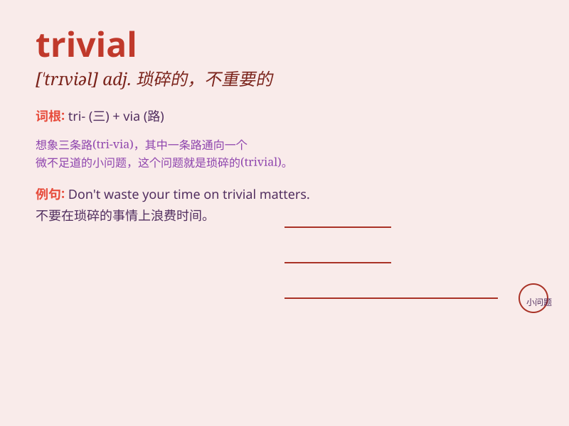

## trivial

**英音:** _[\'trɪvɪəl]_ **美音:** _[\'trɪvɪəl]_

**译义:** *adj.琐细的,价值不高的,微不足道的*

### 短语

+ **trivial matter:** _琐事；小事_

+ **trivial problem:** _小问题；微不足道的问题_

+ **trivial detail:** _琐碎的细节_

+ **trivial pursuit:** _琐碎的追求_

+ **trivial expense:** _小额开支；微不足道的费用_

### 例句

#### 例句1

> **The problem was so trivial that I solved it in a few minutes.**

**中文翻译:** 这个问题太微不足道了，我几分钟就解决了。

**单词释义:** 微不足道的；琐碎的

#### 例句2

> **Don\'t waste time on trivial matters.**

**中文翻译:** 别在琐碎的事情上浪费时间。

**单词释义:** 琐碎的；不重要的

#### 例句3

> **His concerns were often trivial and easily dismissed.**

**中文翻译:** 他的担忧常常是微不足道的，很容易被忽略。

**单词释义:** 微不足道的；不重要的

### 背诵小故事

> One day, Tom was solving a math problem. But it was so trivial that
he finished it quickly. It was just like counting from one to ten. Then
he moved on to more challenging tasks.

**一天，汤姆在解一道数学题。但这道题太琐碎了，他很快就做完了。就像从一数到十那么简单。然后他就去做更有挑战性的任务了。**

### 图义

