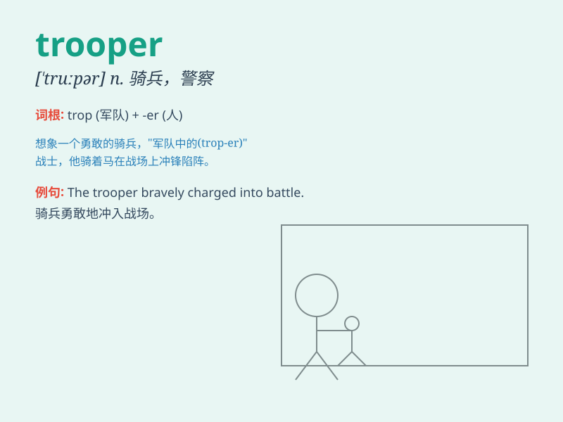

## trooper

**英音:** _[\'truːpə]_ **美音:** _[\'trupɚ]_

**译义:** *n.骑兵,骑警,伞兵*

### 短语

+ **state trooper:** _（美国）州警察_

+ **storm trooper:** _冲锋队员；纳粹党突击队员_

+ **trooper helmet:** _骑兵头盔_

+ **space trooper:** _太空战士；太空骑兵_

+ **army trooper:** _陆军士兵_

### 例句

#### 例句1

> **The trooper was on duty at the border checkpoint.**

**中文翻译:** 这位士兵在边境检查站执勤。

**单词释义:** 士兵

#### 例句2

> **The state trooper pulled over the speeding car.**

**中文翻译:** 州警让超速的汽车停了下来。

**单词释义:** 州警

#### 例句3

> **The brave trooper fought fearlessly in the battle.**

**中文翻译:** 这位勇敢的士兵在战斗中无畏地战斗。

**单词释义:** 士兵

### 背诵小故事

> A brave trooper was on a dangerous mission. He had to cross a wild
forest and climb a high mountain. Despite the difficulties, he never
gave up. Remember, a trooper is a soldier, especially a brave one.

**一位勇敢的士兵正在执行一项危险的任务。他必须穿过一片荒野森林，爬上一座高山。尽管困难重重，他从未放弃。记住，trooper
就是士兵，尤其是勇敢的士兵。**

### 图义

