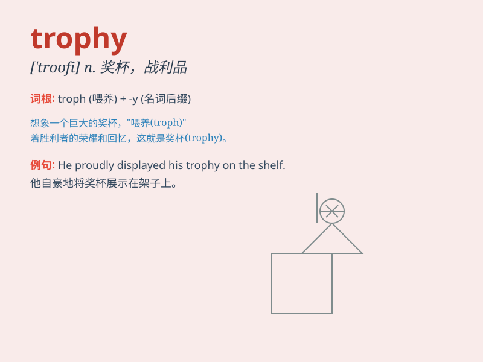

## trophy

**英音:** _[\'trəʊfɪ]_ **美音:** _[trofɪ]_

**译义:** *n.战利品,奖品vt.用战利品装饰,授予\...奖品*

### 短语

+ **win a trophy:** _赢得奖杯_

+ **collect trophies:** _收集奖杯_

+ **display trophies:** _展示奖杯_

+ **coveted trophy:** _令人垂涎的奖杯_

+ **championship trophy:** _冠军奖杯_

### 例句

#### 例句1

> **He won the trophy for the best athlete of the year.**

**中文翻译:** 他赢得了年度最佳运动员的奖杯。

**单词释义:** 奖杯；奖品

#### 例句2

> **The hunting trophy was displayed on the wall of his study.**

**中文翻译:** 那个狩猎的战利品被展示在他书房的墙上。

**单词释义:** 战利品；纪念品

#### 例句3

> **The team was proud to hold the trophy high after the
championship.**

**中文翻译:** 在锦标赛后，这个团队自豪地把奖杯高高举起。

**单词释义:** 奖杯；胜利的象征

### 背诵小故事

> A brave athlete won a fierce competition and was awarded a trophy.
The trophy was shiny and beautiful, symbolizing his hard work and
victory. Everyone admired it. Remember, trophy means a prize or award
for a victory or achievement.

**一位勇敢的运动员赢得了一场激烈的比赛，并被授予了一个奖杯。这个奖杯闪闪发光、十分漂亮，象征着他的努力和胜利。每个人都对其羡慕不已。记住，trophy
意思是作为胜利或成就的奖品或奖励。**

### 图义

