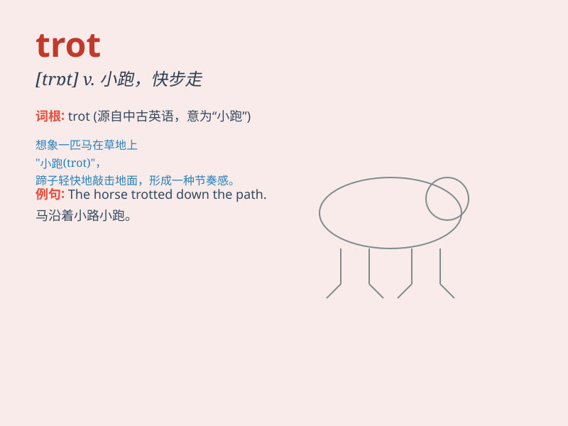

## trot

**英音:** _[trɒt]_ **美音:** _[trɑt]_

**译义:**
*v.(使)小跑,(使)快步走,骑马小跑,疾走n.小跑,骑马,疾走,忙碌*

### 短语

+ **trot along:** _快步走；沿着......小跑_

+ **trot out:** _炫耀；提出（陈旧的想法、借口等）_

+ **on the trot:** _接连地；一个接一个地_

+ **trot horse:** _快步马_

+ **trot sb. around:** _带某人到处逛_

### 例句

#### 例句1

> **The horse trotted along the path.**

**中文翻译:** 这匹马沿着小路小跑。

**单词释义:** 小跑

#### 例句2

> **She trotted to the store to buy some bread.**

**中文翻译:** 她小跑去商店买些面包。

**单词释义:** 小跑

#### 例句3

> **The child trotted happily around the garden.**

**中文翻译:** 孩子在花园里快乐地小跑着。

**单词释义:** 小跑

### 背诵小故事

> 一只小马总是慢悠悠地 trot
着。有一天，它参加比赛，别的马都飞奔，它却依然
trot，结果输了。小马明白了，trot 速度太慢不行，要加快步伐。

**一只小马总是慢悠悠地小跑着。有一天，它参加比赛，别的马都飞奔，它却依然小跑，结果输了。小马明白了，小跑速度太慢不行，要加快步伐。**

### 图义

