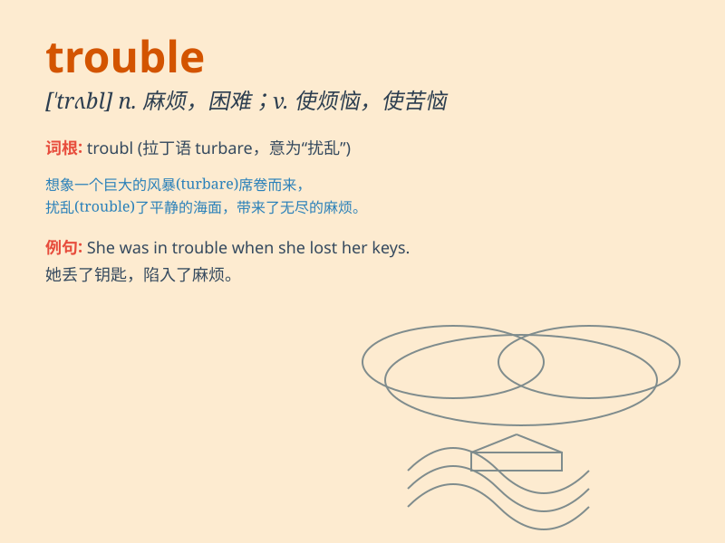

## trouble

**英音:** _[\'trʌb(ə)l]_ **美音:** _[\'trʌbl]_

**译义:**
*n.烦恼,麻烦,动乱,纠纷,疾病,故障,问题vt.(使)烦恼,麻烦,打扰,麻烦自己,费神,费心*

### 短语

+ **get into trouble:** _陷入困境；惹上麻烦_

+ **have trouble (in) doing sth:** _做某事有困难_

+ **cause trouble:** _惹麻烦；造成麻烦_

+ **be in trouble:** _处于困境中；有麻烦_

+ **make trouble:** _捣乱；制造麻烦_

### 例句

#### 例句1

> **I\'m having trouble with my car. It keeps breaking down.**

**中文翻译:** 我的车出了问题。它老是抛锚。

**单词释义:** 问题；麻烦

#### 例句2

> **Don\'t trouble yourself about that matter. It\'s not
important.**

**中文翻译:** 别为那件事烦恼。它不重要。

**单词释义:** 使烦恼；使忧虑

#### 例句3

> **The company is in trouble and may go bankrupt.**

**中文翻译:** 这家公司陷入了困境，可能会破产。

**单词释义:** 困境；危难

### 背诵小故事

> One day, Tom was in trouble. He lost his key and couldn\'t enter the
house. He looked everywhere but still couldn\'t find it. Finally, with
the help of a kind neighbor, he solved the problem.

**一天，汤姆遇到了麻烦。他丢了钥匙，进不了家门。他到处找但还是找不到。最后，在一位好心邻居的帮助下，他解决了这个问题。**

### 图义

