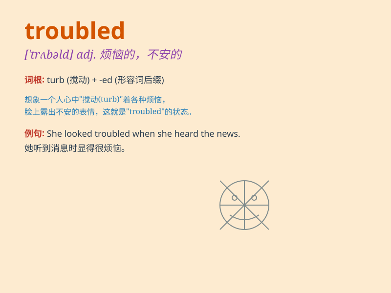

## troubled

**英音:** _[\'trʌb(ə)ld]_ **美音:** _[\'trʌbld]_

**译义:** *adj.麻烦的,杂乱无章的,不平静的*

### 短语

+ **troubled waters:** _混乱的局面；困境_

+ **troubled mind:** _不安的心情；烦恼的思绪_

+ **troubled times:** _艰难时期；动荡时期_

+ **be troubled by:** _被\...\...困扰；因\...\...而烦恼_

+ **troubled sleep:** _不安稳的睡眠；睡眠不佳_

### 例句

#### 例句1

> **The troubled teenager often got into fights at school.**

**中文翻译:** 这个陷入困境的青少年经常在学校打架。

**单词释义:** 陷入困境的

#### 例句2

> **She has a troubled relationship with her parents.**

**中文翻译:** 她和父母的关系很麻烦。

**单词释义:** 麻烦的；令人烦恼的

#### 例句3

> **The economy is in a troubled state.**

**中文翻译:** 经济处于困境之中。

**单词释义:** 动荡不安的；混乱的

### 背诵小故事

> A little bird was troubled. It couldn\'t find its way home. But with
the help of kind children, it finally found the right path. The bird was
no longer troubled.

**一只小鸟陷入了困境。它找不到回家的路。但在善良的孩子们的帮助下，它最终找到了正确的路。小鸟不再烦恼了。**

### 图义

