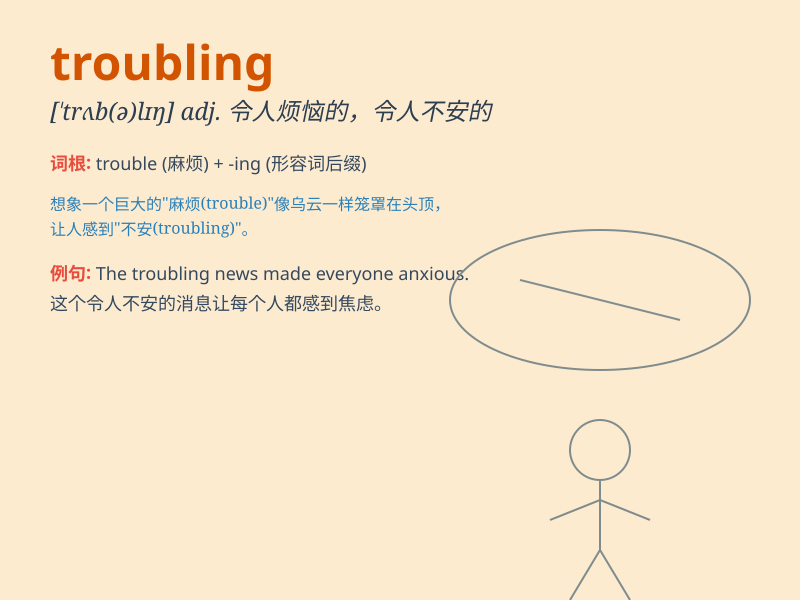

## troubling

**英音:** _[ˈtrʌb.lɪŋ]_ **美音:** _[ˈtrʌb.lɪŋ]_

**译义:**
*adj.令人烦恼的，令人不安的；v.使烦恼，使不安（trouble的现在分词形式）*

### 短语

+ **troubling situation:** _令人不安的情况_

+ **troubling thought:** _令人烦恼的想法_

+ **troubling problem:** _棘手的问题_

+ **troubling behavior:** _令人不安的行为_

+ **troubling trend:** _令人担忧的趋势_

### 例句

#### 例句1

> **The recent increase in crime is very troubling.**

**中文翻译:** 最近犯罪率的上升非常令人不安。

**单词释义:** 令人不安的

#### 例句2

> **It\'s Troubling that he still hasn\'t arrived.**

**中文翻译:** 他还没到，这令人烦恼。

**单词释义:** 令人烦恼的

#### 例句3

> **The Troubling news spread quickly through the town.**

**中文翻译:** 这个令人不安的消息在镇上迅速传播开来。

**单词释义:** 令人不安的

### 背诵小故事

> A little boy was lost in the forest. The dark and unknown paths were
troubling. But with the help of a kind bird, he finally found his way
home. The experience was both scary and Troubling.

**一个小男孩在森林里迷路了。黑暗和未知的道路令人烦恼。但在一只善良的鸟的帮助下，他最终找到了回家的路。这次经历既可怕又令人烦恼。**

### 图义

