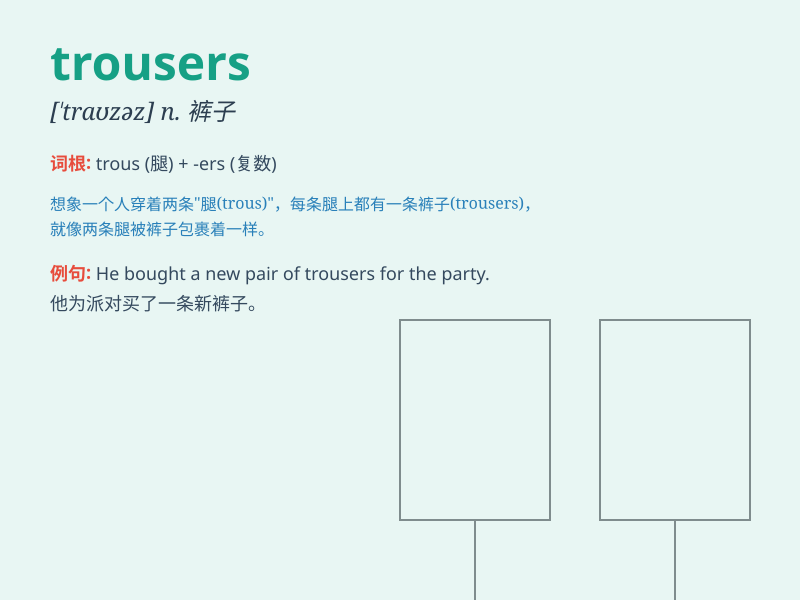

## trousers

**英音:** _[\'traʊzəz]_ **美音:** _[\'traʊzɚz]_

**译义:** *n.pl.裤子,长裤*

### 短语

+ **a pair of trousers:** _一条裤子_

+ **wide trousers:** _宽腿裤_

+ **long trousers:** _长裤_

+ **short trousers:** _短裤_

+ **trousers pocket:** _裤兜_

### 例句

#### 例句1

> **He wore a pair of black trousers.**

**中文翻译:** 他穿着一条黑色的裤子。

**单词释义:** 裤子

#### 例句2

> **These trousers are too tight for me.**

**中文翻译:** 这些裤子对我来说太紧了。

**单词释义:** 裤子

#### 例句3

> **She bought new trousers for the party.**

**中文翻译:** 她为聚会买了新裤子。

**单词释义:** 裤子

### 背诵小故事

> One day, Tom was going to a party. But he found his old trousers had
a hole. So he quickly went to the store and bought a new pair of
trousers. Finally, he looked smart and had a great time at the party.

**一天，汤姆要去参加派对。但他发现他的旧裤子有个洞。所以他赶紧去商店买了一条新裤子。最后，他看起来很帅气，在派对上度过了愉快的时光。**

### 图义

