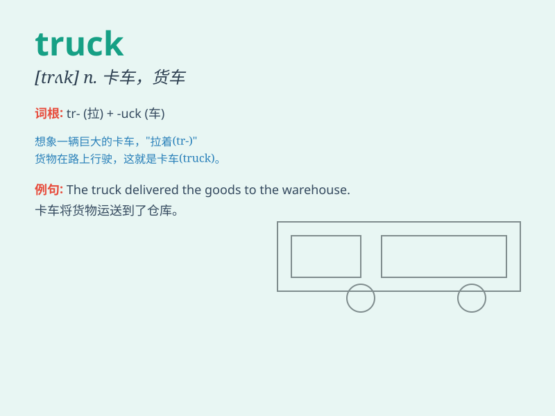

## truck

**英音:** _[trʌk]_ **美音:** _[trʌk]_

**译义:**
*n.卡车,敞棚货车,(车站)搬行李用的手推车,交易,交换,废话,废物,实物工资vt.交易,交往,以卡车运输vi.驾驶卡车,以物易物adj.\<主美>运货汽车的*

### 短语

+ **fire truck:** _消防车_

+ **dump truck:** _自卸卡车_

+ **food truck:** _美食车_

+ **pickup truck:** _皮卡；轻型货车_

+ **delivery truck:** _送货车_

### 例句

#### 例句1

> **The truck is delivering goods to the warehouse.**

**中文翻译:** 这辆卡车正在向仓库运送货物。

**单词释义:** 卡车

#### 例句2

> **He drives a big truck for a living.**

**中文翻译:** 他以开一辆大卡车为生。

**单词释义:** 卡车

#### 例句3

> **The toy truck is very cute.**

**中文翻译:** 这个玩具卡车非常可爱。

**单词释义:** 卡车

### 背诵小故事

> One day, a little boy saw a big truck on the road. The truck was
carrying many toys. The boy was so excited and shouted, \'Look at that
truck!\' From then on, he always remembered the word \'truck\'.

**一天，一个小男孩在路上看到一辆大卡车。卡车正载着许多玩具。男孩非常兴奋，大喊："看那辆卡车！"从那以后，他总是记住了"truck"这个单词。**

### 图义

