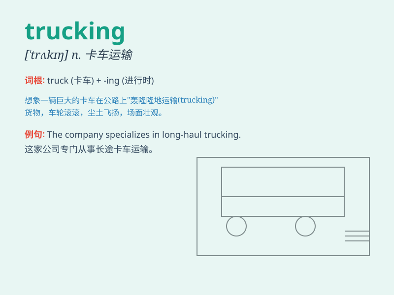

## trucking

**英音:** _[ˈtrʌkɪŋ]_ **美音:** _[ˈtrʌkɪŋ]_

**译义:** *n.货车运输,货车运输业*

### 短语

+ **trucking company:** _货运公司_

+ **trucking industry:** _货运行业_

+ **trucking business:** _货运业务_

+ **long-haul trucking:** _长途货运_

+ **local trucking:** _本地货运_

### 例句

#### 例句1

> **The trucking industry plays a crucial role in the economy.**

**中文翻译:** 货运业在经济中起着至关重要的作用。

**单词释义:** 货运；货运业

#### 例句2

> **He decided to pursue a career in trucking.**

**中文翻译:** 他决定从事货运工作。

**单词释义:** 货运；运输业

#### 例句3

> **Trucking companies need to comply with strict safety
regulations.**

**中文翻译:** 货运公司需要遵守严格的安全规定。

**单词释义:** 货运业务；货运行业

### 背诵小故事

> One day, Tom decided to start a new career in trucking. He drove a
big truck across the country, delivering goods. The trucking job was
tough but rewarding. It made him realize the importance of
responsibility on the road.

**一天，汤姆决定开启卡车运输的新职业生涯。他开着一辆大卡车穿越全国，运送货物。卡车运输工作虽然艰难但很有收获。这让他明白了在路上责任的重要性。**

### 图义

