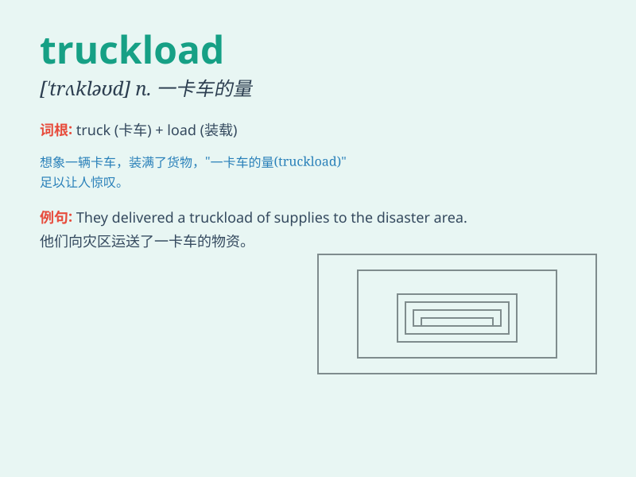

## truckload

**英音:** _[\'trʌkləʊd]_ **美音:** _[\'trʌklod]_

**译义:** *n.一货车的容量*

### 短语

+ **a truckload of goods:** _一卡车的货物_

+ **truckload capacity:** _卡车运载能力_

+ **full truckload:** _满载的卡车_

+ **truckload shipment:** _卡车运输_

+ **empty truckload:** _空的卡车载货量_

### 例句

#### 例句1

> **The company received a truckload of new products.**

**中文翻译:** 这家公司收到了一卡车的新产品。

**单词释义:** 一卡车的量

#### 例句2

> **They bought a truckload of furniture for the new house.**

**中文翻译:** 他们为新房子买了一卡车的家具。

**单词释义:** 一卡车的量

#### 例句3

> **The warehouse was filled with truckloads of goods.**

**中文翻译:** 仓库里堆满了一卡车一卡车的货物。

**单词释义:** 一卡车的量

### 背诵小故事

> A poor village was in great need of food. One day, a kind man sent a
truckload of fresh vegetables and grains. The villagers were so happy
and grateful. With this truckload of supplies, they could survive the
hard times.

**一个贫困的村庄急需食物。有一天，一位善良的人送来了一卡车的新鲜蔬菜和谷物。村民们非常高兴和感激。有了这一卡车的物资，他们能够度过艰难时期。**

### 图义

