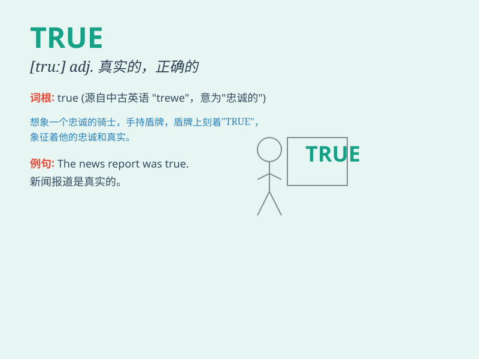

## TRUE

**英音:** _[truː]_ **美音:** _[tru]_

**译义:** *adj.真实的,真正的,忠实的,忠诚的,正确的*

### 短语

+ **true to form:** _一如既往，合乎常情_

+ **come true:** _实现；成真_

+ **true love:** _真爱_

+ **true friend:** _真正的朋友_

+ **true meaning:** _真正的意义_

### 例句

#### 例句1

> **It is true that he has a lot of money.**

**中文翻译:** 他有很多钱，这是真的。

**单词释义:** 真实的；确实的

#### 例句2

> **She always tells the true story.**

**中文翻译:** 她总是讲述真实的故事。

**单词释义:** 真实的

#### 例句3

> **A true friend is hard to find.**

**中文翻译:** 真正的朋友很难找到。

**单词释义:** 真正的

### 背诵小故事

> Once upon a time, a detective was looking for the truth. He faced
many lies but never gave up. Finally, he found the true evidence and
solved the case. The word \'true\' means real and not false.

**从前，有个侦探在寻找真相。他面对许多谎言但从不放弃。最终，他找到了真实的证据并破了案。单词\'true\'意思是真实的、不假的。**

### 图义

