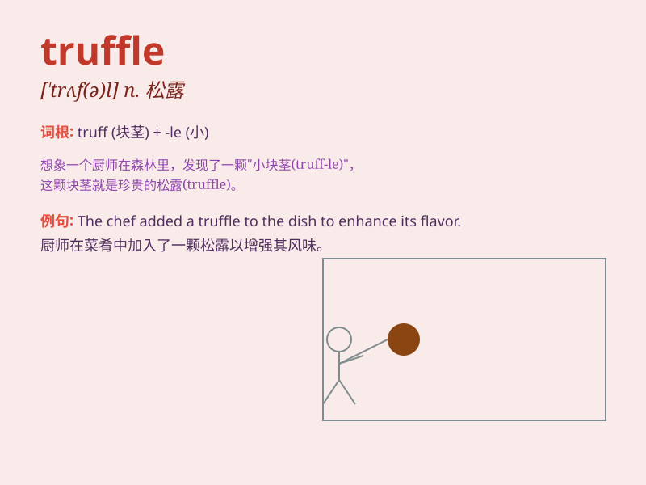

## truffle

**英音:** _[\'trʌf(ə)l]_ **美音:** _[\'trʌfl]_

**译义:** *n.[植]块菌*

### 短语

+ **black truffle:** _黑松露_

+ **white truffle:** _白松露_

+ **truffle oil:** _松露油_

+ **truffle hunting:** _寻找松露_

+ **truffle season:** _松露季节_

### 例句

#### 例句1

> **I love the taste of chocolate truffles.**

**中文翻译:** 我喜欢巧克力松露的味道。

**单词释义:** 松露（一种巧克力）

#### 例句2

> **The pig is trained to hunt for truffles.**

**中文翻译:** 这头猪经过训练来寻找松露。

**单词释义:** 松露（一种菌类）

#### 例句3

> **She received a box of truffles as a gift.**

**中文翻译:** 她收到了一盒松露作为礼物。

**单词释义:** 松露（一种食品）

### 背诵小故事

> One day, a little pig was looking for food in the forest and suddenly
smelled a wonderful smell. It followed the smell and found a truffle
hidden under the ground. The truffle was so precious and delicious.

**有一天，一只小猪在森林里找食物，突然闻到一股美妙的气味。它顺着气味找去，发现了藏在地下的一块松露。松露是如此珍贵和美味。**

### 图义

