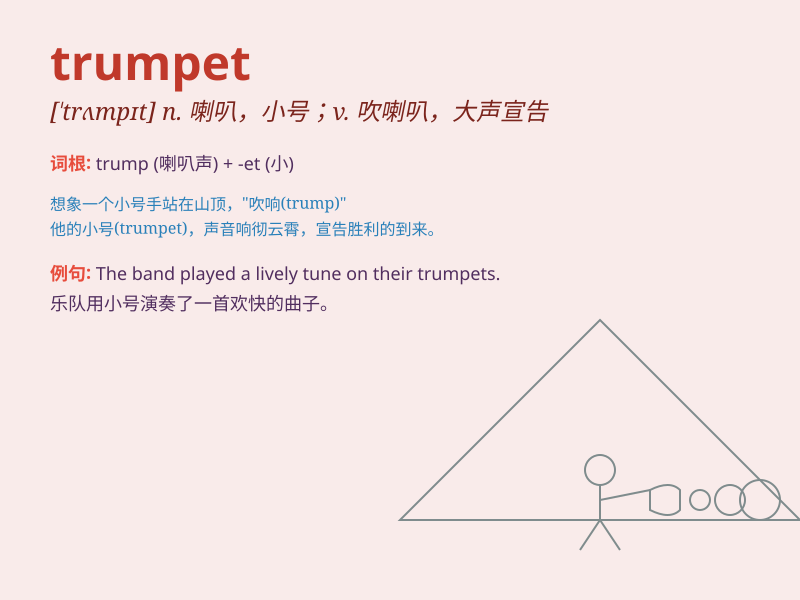

## trumpet

**英音:** _[\'trʌmpɪt]_ **美音:** _[\'trʌmpɪt]_

**译义:** *n.喇叭*

### 短语

+ **blow the trumpet:** _自吹自擂_

+ **trumpet call:** _紧急召唤；战斗号令_

+ **sound the trumpet:** _吹号；发出警报_

+ **trumpet flower:** _喇叭花_

+ **trumpet major:** _（英国陆军的）喇叭手长_

### 例句

#### 例句1

> **The musician played a beautiful melody on the trumpet.**

**中文翻译:** 这位音乐家在小号上演奏了一段优美的旋律。

**单词释义:** 小号

#### 例句2

> **He trumpeted his success to everyone he met.**

**中文翻译:** 他向遇到的每个人吹嘘自己的成功。

**单词释义:** 吹嘘；宣扬

#### 例句3

> **The elephant trumpeted loudly.**

**中文翻译:** 大象大声地吼叫。

**单词释义:** 吼叫

### 背诵小故事

> A little monkey dreams of playing the trumpet. One day, it finds a
trumpet in the forest. It practices hard and finally plays beautiful
music. Everyone loves its trumpet sound.

**一只小猴子梦想着吹小号。有一天，它在森林里找到了一个小号。它努力练习，最终吹出了美妙的音乐。大家都喜欢它的小号声。**

### 图义

