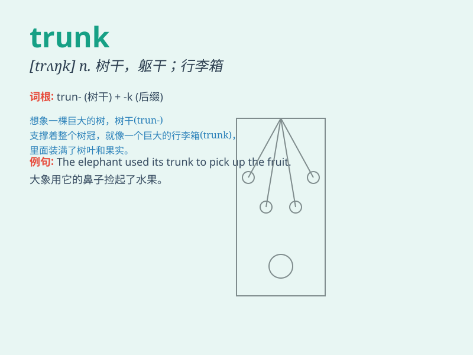

## trunk

**英音:** _[trʌŋk]_ **美音:** _[trʌŋk]_

**译义:**
*n.干线,树干,躯干,箱子,主干,象鼻vt.把\...放入旅行箱内adj.树干的,躯干的,干线的,箱形的*

### 短语

+ **trunk road:** _干道；干线公路_

+ **elephant trunk:** _象鼻_

+ **trunk call:** _长途电话_

+ **tree trunk:** _树干_

+ **trunk line:** _干线；中继线_

### 例句

#### 例句1

> **The elephant used its trunk to pick up the food.**

**中文翻译:** 大象用它的象鼻捡起食物。

**单词释义:** 象鼻

#### 例句2

> **He put his clothes in the trunk of the car.**

**中文翻译:** 他把衣服放进汽车后备箱。

**单词释义:** 后备箱

#### 例句3

> **The tree trunk is very thick.**

**中文翻译:** 这棵树干非常粗。

**单词释义:** 树干

### 背诵小故事

> A little elephant was lost in the forest. It found a big tree and hid
behind its trunk. The trunk was so thick and strong that it felt safe.
Finally, its mother found it by the special trunk.

**一只小象在森林里迷路了。它发现了一棵大树，躲在树干后面。树干又粗又壮，让它觉得很安全。最后，它的妈妈通过这特别的树干找到了它。**

### 图义

