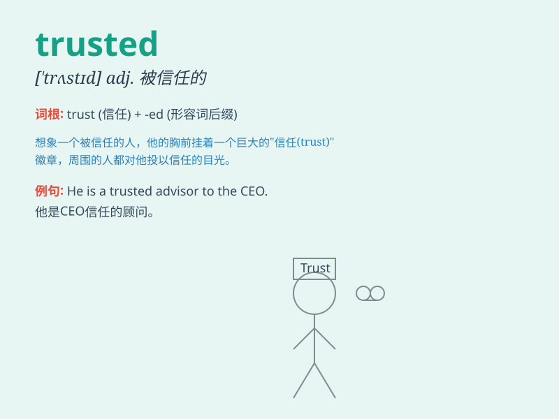

## trusted

**英音:** _[ˈtrʌstɪd]_ **美音:** _[ˈtrʌstɪd]_

**译义:** *adj.
被信任的，可靠的；受信赖的；被信赖的（trust的过去式和过去分词）*

### 短语

+ **trusted friend:** _可信赖的朋友_

+ **trusted advisor:** _值得信赖的顾问_

+ **trusted source:** _可靠的来源_

+ **trusted partner:** _可信任的合作伙伴_

+ **trusted information:** _可信的信息_

### 例句

#### 例句1

> **She trusted him implicitly.**

**中文翻译:** 她绝对信任他。

**单词释义:** 信任

#### 例句2

> **He is a trusted friend.**

**中文翻译:** 他是一位可信赖的朋友。

**单词释义:** 可信赖的

#### 例句3

> **The information came from a trusted source.**

**中文翻译:** 这信息来自一个可靠的来源。

**单词释义:** 可靠的

### 背诵小故事

> Once upon a time, there was a secret treasure chest. Only the trusted
friends of the owner knew the key. They were reliable and never betrayed
the trust. So, \'trusted\' means being reliable and worthy of trust.

**从前，有一个秘密的宝箱。只有主人信任的朋友知道钥匙。他们可靠，从不背叛信任。所以，'trusted'意思是可靠的、值得信任的。**

### 图义

