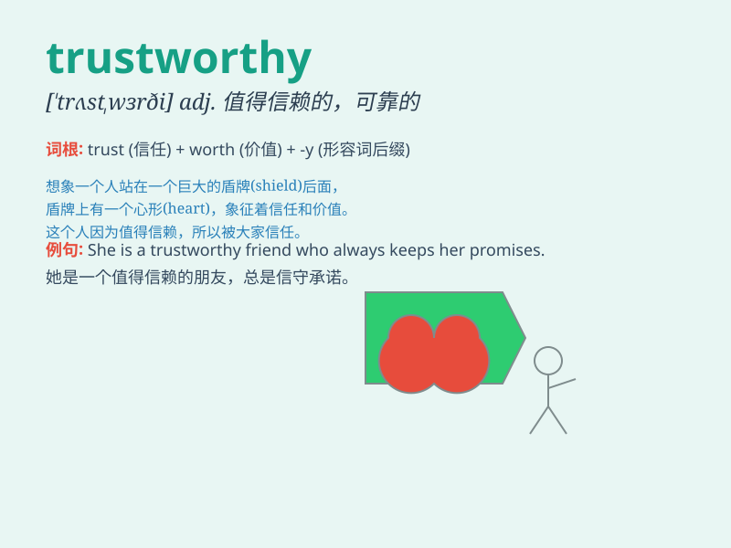

## trustworthy

**英音:** _[\'trʌs(t)wɜːðɪ]_ **美音:** _[\'trʌstwɝði]_

**译义:** *adj.可信赖的*

### 短语

+ **be trustworthy:** _是值得信赖的_

+ **trustworthy person:** _值得信赖的人_

+ **trustworthy source:** _可靠的来源_

+ **find someone trustworthy:** _找到值得信赖的某人_

+ **seem trustworthy:** _看起来值得信赖_

### 例句

#### 例句1

> **He is a trustworthy friend who always keeps his promises.**

**中文翻译:** 他是一个值得信赖的朋友，总是信守承诺。

**单词释义:** 值得信赖的

#### 例句2

> **The company has a trustworthy reputation in the market.**

**中文翻译:** 这家公司在市场上有值得信赖的声誉。

**单词释义:** 值得信赖的

#### 例句3

> **We need to find a trustworthy partner for this project.**

**中文翻译:** 我们需要为这个项目找一个值得信赖的合作伙伴。

**单词释义:** 值得信赖的

### 背诵小故事

> One day, I lost my wallet. A kind stranger found it and returned it
to me with everything intact. I realized he was trustworthy because he
didn\'t keep a single thing. From then on, I knew trustworthy people can
be relied on.

**有一天，我丢了钱包。一个善良的陌生人捡到后原封不动地还给了我。我意识到他是值得信赖的，因为他什么都没留。从那以后，我知道了值得信赖的人是可以依靠的。**

### 图义

