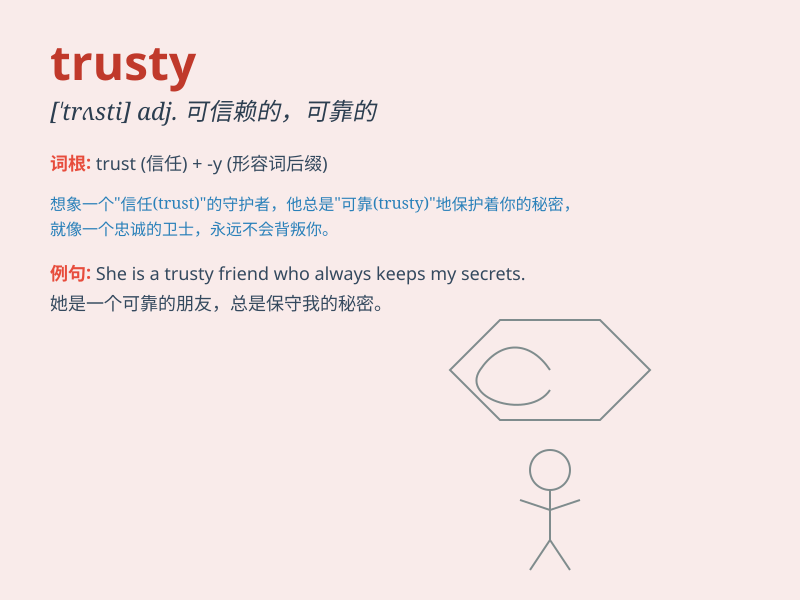

## trusty

**英音:** _[\'trʌstɪ]_ **美音:** _[\'trʌsti]_

**译义:** *adj.可信赖*

### 短语

+ **trusty friend:** _可信赖的朋友_

+ **trusty companion:** _可靠的伙伴_

+ **trusty steed:** _忠实的坐骑_

+ **trusty servant:** _忠实的仆人_

+ **trusty knife:** _可靠的刀_

### 例句

#### 例句1

> **The old car has been my trusty companion on many road trips.**

**中文翻译:** 这辆旧车在许多次公路旅行中一直是我可靠的伙伴。

**单词释义:** 可靠的；可信赖的

#### 例句2

> **He always relies on his trusty bike to get around the city.**

**中文翻译:** 他总是依靠他那辆可靠的自行车在城市里出行。

**单词释义:** 可靠的；值得信赖的

#### 例句3

> **The trusty dog followed its owner everywhere.**

**中文翻译:** 这只忠实的狗到处跟着它的主人。

**单词释义:** 忠实的；可信的

### 背诵小故事

> Once upon a time, there was a knight who had a trusty horse. The
horse was always by his side, never failing him in battles. The knight
knew he could rely on his trusty companion. So, \'trusty\' means
reliable and deserving of trust.

**从前，有一位骑士，他有一匹值得信赖的马。这匹马总是在他身边，在战斗中从未让他失望。骑士知道他可以依靠他忠实的伙伴。所以，'trusty'意思是可靠的、值得信赖的。**

### 图义

