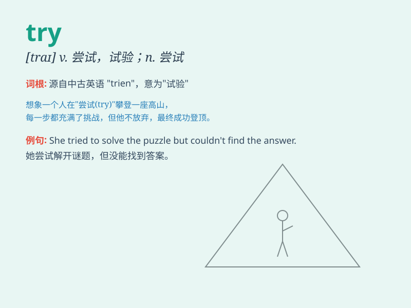

## try

**英音:** _[traɪ]_ **美音:** _[traɪ]_

**译义:** *n.尝试v.试,试图,努力,试验,磨难,考验,审问*

### 短语

+ **try on:** _试穿_

+ **try out:** _试验；试用_

+ **try one\'s best:** _尽某人最大的努力_

+ **give it a try:** _试一试_

+ **try for:** _谋求；争取_

### 例句

#### 例句1

> **I will try my best to finish the task.**

**中文翻译:** 我会尽我最大的努力完成这项任务。

**单词释义:** 努力，尽力

#### 例句2

> **Let\'s try this new restaurant.**

**中文翻译:** 咱们试试这家新餐馆。

**单词释义:** 尝试

#### 例句3

> **She tried to open the door, but it was locked.**

**中文翻译:** 她试图打开门，但门是锁着的。

**单词释义:** 试图，企图

### 背诵小故事

> One day, Tom wanted to bake a cake. He didn\'t know if it would be
good, but he decided to try. He mixed the ingredients carefully and put
it in the oven. Finally, his try was successful and the cake was
delicious.

**一天，汤姆想烤一个蛋糕。他不知道是否能做好，但他决定尝试一下。他仔细地混合配料并把它放进烤箱。最后，他的尝试成功了，蛋糕很美味。**

### 图义

